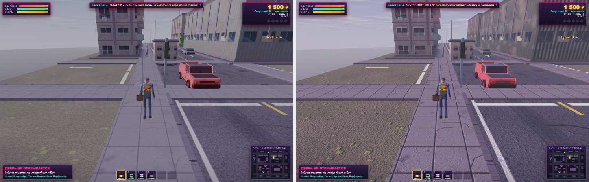
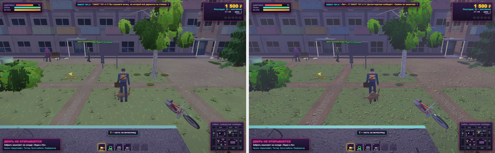
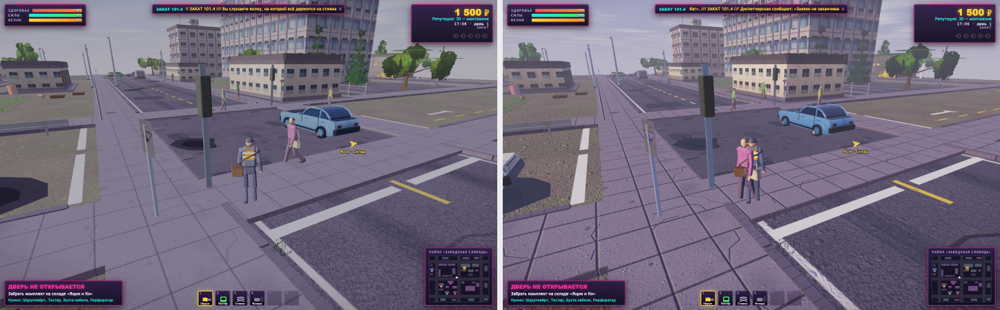

# Монтаж-Сити 3D — журнал работ по рендеру

Один этап — одна запись. В каждой: что сделано, цифры до и после, что откатил
и почему. Подробное состояние на текущий момент — в
[`RENDER-STATE.md`](RENDER-STATE.md).

Ограничения, которые не обсуждаются и переносятся из этапа в этап: один
самодостаточный `index.html`, чистый WebGL2, свои шейдеры, своя математика,
процедурная геометрия и текстуры, свой скелетный скиннинг. Ни движка, ни
библиотек, ни npm, ни сборки. Игра открывается из `file://` без единого
сетевого запроса. Цель — устойчивые 60 FPS с провалами не ниже 45 на Mac
mini M4 в Chrome, с учётом Retina.

---

## Этап 00 — измерить и разметить · 2026-09-04

**Задача:** ничего не оптимизировать. Снять базу, выбрать контрольные сцены,
разметить файл, назвать узкие места.

### Что сделано

* **Карта файла.** Оглавление комментарием в начале `index.html` (сразу после
  `<!DOCTYPE html>`, до `<html>` — так оно не влияет на режим разбора
  документа): структура файла, разделы по ролям, диапазоны строк, подразделы по
  функциям-якорям. Собирается генератором `tools/toc.mjs`, поэтому не устареет
  после первой же правки: `node tools/toc.mjs` пересобирает,
  `--check` проверяет и возвращает 1, если разошлось.
* **Оснастка замера** в `games/montazh-city-3d/tools/` — пять файлов,
  описание в `tools/README.md`. Игру не трогают: телеметрия ставится в
  страницу до загрузки через `page.addInitScript`, сцена задаётся штатным
  файлом сохранения игры в `localStorage`. Ни одного отладочного крючка в
  `index.html` не добавлено.
* **Три контрольные сцены** с точными координатами, поворотом и временем суток
  — открытая улица, плотная застройка, техника в движении. Повторяются от
  прогона к прогону: `Math.random` посеян фиксированно, кадры с открытым
  диалогом выбрасываются.
* **Базовый замер** трёх сцен: FPS, время кадра p50/p95/p99, draw call'ы по
  проходам, треугольники, время кадра в главном потоке.
* **Разбор кадра по проходам** — небо, статика, тени, динамика, свечения.
* **Профиль главного потока** сэмплирующим профилировщиком V8 через CDP.
* **Время загрузки** по фазам, отдельно генерация текстур.
* **Инвентарь памяти** под текстуры и буферы.
* **Скриншоты** трёх сцен в `docs/shots/00-base/`.
* **`docs/RENDER-STATE.md`** — всё вышеперечисленное плюс список узких мест по
  убыванию стоимости.

### Метрики «до»

Chromium 141, программный растеризатор SwiftShader, 1440×900 CSS при
`devicePixelRatio = 2` (буфер отрисовки 1800×1125 — игра сама режет плотность
до 1.25).

| | Улица | Двор | Перекрёсток |
| --- | ---: | ---: | ---: |
| FPS | 2.73 | 1.94 | 2.07 |
| Кадр p50 | 366.7 мс | 516.6 мс | 483.3 мс |
| Кадр p95 | 400.0 мс | 533.4 мс | 500.1 мс |
| Главный поток p50 | 1.5 мс | 1.9 мс | 1.6 мс |
| Draw call'ов | 96 | 115 | 132 |
| Треугольников | 173 100 | 197 032 | 226 048 |

Загрузка до первого кадра ≈ 728 мс, из них генерация текстур ≈ 348 мс (48 %),
геометрия района ≈ 200 мс, персонажи и техника ≈ 88 мс.
Память на GPU ≈ 54 МиБ: 37.2 МиБ текстур с мип-уровнями (39 штук, все `RGBA8`)
и 17.0 МиБ буферов.

Метрик «после» у этого этапа нет и быть не должно: в игре не менялось ничего,
кроме комментария с оглавлением.

### Что нашлось

По убыванию стоимости в кадре:

1. **Весь район рисуется каждый кадр целиком — 67–74 % кадра.** `drawStatic`
   отправляет 36 вызовов и 98 701 треугольник, и эти числа совпадают до
   треугольника во всех трёх сценах: отсева ни по пирамиде видимости, ни по
   расстоянию нет вовсе. Больше половины треугольников кадра — за спиной у
   камеры.
2. **Кадр упирается в заливку, а не в вызовы.** Замер по разрешению даёт
   модель «≈57 мс постоянных + 0.162 мкс на пиксель». При 96–132 вызовах в
   вызовы упереться нечем — дорог `FS_MAIN`.
3. **Небо стоит 65 мс на любой сцене** при одном треугольнике: `fbm` в пять
   октав, до 40 вычислений хеша на пиксель, и считается для всего экрана до
   всякой геометрии.
4. **Тени и свечения — 33–49 смен программы ради 66–98 треугольников.** По
   времени сейчас копейки, но это худшее соотношение «смен состояния к работе».
5. **Главный поток почти свободен: 1.5–1.9 мс на кадр**, ни одной горячей
   точки. Оптимизировать JS на этом этапе смысла нет.

### Что не получилось и почему

Замер выполнен в линуксовом контейнере **без графического ускорителя** (Intel
Xeon, 4 ядра, `/dev/dri` отсутствует, рендерер — ANGLE поверх SwiftShader).
Отсюда три незакрытых пункта:

* **Время на GPU не снято таймер-запросами.** В SwiftShader нет
  `EXT_disjoint_timer_query_webgl2`. Поддержка в `perf-inject.js` написана
  целиком, с пулом запросов и проверкой `GPU_DISJOINT_EXT`, и включится сама,
  как только расширение появится.
* **Chrome против Safari не сравнён.** Safari существует только на macOS, а
  сборку WebKit для Playwright сюда не поставить: сетевая политика окружения
  отдаёт 403 на `cdn.playwright.dev` и `playwright.download.prss.microsoft.com`.
  Оснастка к сравнению готова и проверена на двух реальных наборах данных:
  `tools/mac-baseline.sh` снимает оба браузера и складывает сводку одной
  командой. Для настоящего Safari — `tools/ext-probe.js` в консоль и вкладка
  Timelines.
* **Расширения проверены только в Chromium/SwiftShader.** `ext-probe.js` для
  Safari написан, снять его — пять минут на Mac (процедура в `RENDER-STATE.md`,
  раздел 8).

Абсолютные FPS в таблице выше — это скорость программной растеризации, а не
свойство игры. Переносятся форма нагрузки, число вызовов и треугольников,
объём памяти, время генерации текстур и список узких мест в коде.

### Что откатил

* **Профилировку проходов через `gl.finish()`.** Первая версия отбивала
  границы проходов вызовом `gl.finish()`, и получила ерунду: сумма проходов
  вышла 0.9 мс при кадре в 133 мс. Проверил отдельным замером — на этом стеке
  `gl.finish()` возвращается за 0 мс на отрисовке, которая реально идёт 345 мс,
  и `fenceSync` + `clientWaitSync(SYNC_FLUSH_COMMANDS_BIT, 1 с)` тоже за 0 мс.
  Дожидается GPU только `readPixels` — на него и переделал. После этого сумма
  проходов сошлась с временем кадра в пределах 1–2 %.
* **Первую точку сцены «плотная застройка» (x=45, z=45).** Устоявшаяся камера
  (6 м за спиной) оказывалась внутри кроны клёна: замер мерил крупный план
  листа, а не двор. Сдвинул на x=50.
* **Ещё более раннюю точку (x=58, z=52).** В 6 метрах стоит Клянчила,
  подходил знакомиться и открывал диалог — а с открытым диалогом `step()` не
  вызывает `updateWorld`, мир стоит. Окно замера уходило в разговор целиком.
  Новая точка — в 15 м от него.
* **Подсчёт перцентилей по уцелевшим кадрам.** Выброшенные кадры склеивались, и
  p99 показывал «кадр 19.9 секунды» там, где была пауза на диалоге. Переделал:
  время кадра считается только между соседями по исходной последовательности.
* **Окно замера по секундомеру.** Реплика диалога прокликивается по одной за
  кадр, поэтому на 1.5 FPS один брифинг съедал 33 секунды из 45 и оставлял 19
  интервалов на весь p95. Заменил на «не меньше N чистых кадров» (`--minFrames`).

### Проверка

Игра открыта из `file://` во всех прогонах: район строится, брифинг
проигрывается, заявка выдаётся, машины и жители двигаются, ошибок на странице
за все прогоны — **ноль**. `node tools/toc.mjs --check` проходит.

Одна деталь, которая смущает на скриншотах: в левом нижнем углу написано
«Смена окончена». Это надпись HUD при `S.mission === null` (`taskText`,
строка 7018), а не конец игры — игрок стоит на месте всё окно замера, срок
заявки выходит. На замер не влияет.

### Дополнение того же дня: оснастка под запуск на Mac

Первые попытки прогнать замер на Mac упёрлись не в код, а в запуск: команды
выполнялись из домашней папки, а `playwright`, поставленный в `~`, не находился
из папки игры. Поправил так, чтобы этого класса ошибок больше не было.

* **`tools/find-playwright.mjs`** — ищет `playwright` рядом со скриптом, вверх
  по дереву, в глобальной папке npm, в домашней и в `NODE_PATH`. Выставлять
  переменные окружения больше не нужно. Если не нашёл — печатает, что именно
  выполнить, а не `Cannot find module`.
* **`tools/mac-baseline.sh`** — весь замер одной командой: ставит недостающее,
  прогоняет три сцены в Chromium и в WebKit, снимает профиль главного потока,
  складывает сводку. Сам определяет, где лежит игра, и не зависит от текущей
  папки.
* **`tools/compare.mjs`** — сводит два прогона в готовую markdown-таблицу:
  время кадра, вызовы, треугольники, время на GPU, разбор по проходам, разница
  в расширениях, память. Проверен на двух реальных наборах данных.

Метрики не менялись: это только про запуск.

---

## Этап 02 — каркас качества и текстуры · 2026-09-05

**Задача:** единый блок конфигурации качества; масштаб рендера с
динамической подстройкой под частоту монитора; переключатель профилей в
игре; для каждого материала — комплект карт (albedo, normal, roughness,
metalness, AO) вместо одной картинки; развести цветовые пространства;
анизотропию и мипы — в конфигурацию; triplanar и detail-нормаль; массивы
текстур вместо россыпи; генерацию — по кадрам, с полосой прогресса.
Замер — на Mac mini M4, в Chromium (ANGLE Metal) и в WebKit.

### Что сделано

**Часть А — каркас.**

* **Блок конфигурации `QCFG`** в начале `index.html` (раздел «Конфигурация
  качества и производительности», сразу после `'use strict'`). Все числа
  качества — там: три профиля, параметры авто-масштаба, измерение частоты
  монитора, плотность слоя интерфейса, пределы шейдера, дальности свечений,
  размеры и параметры текстур, коэффициенты цвета. В шейдерах и в проходах
  кадра «магических» чисел больше нет: `Math.min(8, …)` источников света,
  `Math.min(1.25, dPR)`, `lampR = lowFx ? 32 : 52`, радиусы 26/55/45 м,
  `TEX_SS = 2`, анизотропия 8 — всё читается из `Q` (активный профиль) и
  `QCFG`.
* **Масштаб рендера** (`resizeGL` → `applyRenderSize`): сцена рисуется в
  буфер размером `GL.w × dpr × scale`, а на экран его растягивает композитор
  браузера. Буфер отрисовки и есть холст: ни лишнего прохода, ни памяти под
  промежуточный буфер, мультисэмплинг разрешается там же, где и раньше.
  Слой интерфейса (`#hud2d`, DOM, мини-игры) живёт в своей полной плотности
  (`QCFG.uiDprMax = 2`, раньше — те же 1.25×, что и сцена) и от масштаба не
  зависит: реплики, метки и стрелка к цели теперь чёткие на Retina.
* **Динамический масштаб** (`Perf`, раздел 7). Три сигнала: частота монитора
  (медиана интервалов `requestAnimationFrame`, прижатая к известным
  частотам, перемеряется раз в 15 с), время кадра на GPU
  (`EXT_disjoint_timer_query_webgl2`, результат читается без ожидания через
  кадр-два) и пропуски кадров по интервалам rAF — единственный сигнал там,
  где таймера нет (WebKit). Бюджет — 80 % интервала монитора. Четыре кадра
  подряд сверх бюджета — шаг вниз (крупнее при большом перерасходе, до ×3),
  полторы секунды с запасом (GPU < 60 % бюджета) — шаг вверх; между шагами
  пауза 350 мс, масштаб округляется к сетке 0.025, чтобы буфер не
  перевыделялся по пустякам. После «вверх и сразу вниз» верхняя планка
  держится 8 с — масштаб не пилит. Пропуски кадров считаются долей за
  последние 60 кадров, а не сбросом: один рывок сборщика мусора запас не
  обнуляет; при живом таймере пропуск учитывается, только если GPU и так
  занят хотя бы наполовину — иначе это планировщик браузера, а не наша
  нагрузка. Проверено: при буфере 5120×3200 масштаб опускается до 0.775 за
  две секунды, после уменьшения окна возвращается к 1.0 за восемь.
* **Профили** `low` / `medium` / `high` и переключатель в настройках
  («Качество: …», «Авто-масштаб: вкл/выкл») плюс живая строка состояния:
  буфер, масштаб, частота монитора, бюджет, время GPU, длина кадра, число
  шагов. Профиль хранится в настройках (`quality`, `dynamic`); прежний
  `lowFx: true` читается как `low`. Новому игроку профиль подбирается по
  GPU: Retina и Apple/RTX/Radeon — `high`, иначе `medium`; выбор
  закрепляется при первом запуске. Что применяется сразу: плотность,
  масштаб, анизотропия, число источников, дальности, частицы, полоски
  развёртки, **размер текстур** (пересборка прямо в игре с полосой
  прогресса, старые текстуры удаляются после подмены). Что требует
  перезапуска: мультисэмплинг (атрибут контекста) и плотность зелени
  (`VEG` зашит в геометрию района) — игра предупреждает тостом. `S.lowFx` и
  неподключённый `VEG` сложены в эти профили, третьего механизма нет.

**Часть Б — текстуры.**

* **Комплект карт для 15 материалов поверхностей** (`SURF_DEFS`, раздел 3):
  asphalt, road, sidewalk, panel, stucco, brick, indust, garage, roof,
  ground, grass, bark, birch, metal, shopGlass. У каждого два холста:
  `albedo` (прежний рисунок, без изменений) и `height` — карта высот той же
  кистью и с тем же посевом случайных чисел, поэтому трещины, швы,
  кирпичи, рёбра профлиста и рамы окон ложатся ровно на свои места. Из
  высот считаются **нормаль по Собелю** (замкнутое поле, тайлится) и
  **ambient occlusion** (полости: размытие высот минус высота),
  **шероховатость** — правилом материала (база, по высоте, по яркости),
  **металличность** — константа либо маска (профлист и ворота: лист —
  металл, ржавчина — нет). Карты зелени и знаков, вывески, ткань, краска и
  белая заглушка получают только albedo плюс константы материала: нормаль
  на фанерке листа и на вывеске ничего не даёт, а по памяти и времени они
  самые дорогие. Бюджет считался заранее: полный комплект из пяти
  отдельных RGBA8-текстур дал бы ~180 МиБ; упаковка `albedo` (RGBA8) +
  `surf` (nx, ny, roughness, metalness — RGBA8) + `ao` (R8) для 15
  материалов и albedo-only для остальных — **62 МиБ с мипами** против 37.
* **Цветовые пространства разведены.** Albedo — `SRGB8_ALPHA8`: семплер
  отдаёт линейный цвет, мипы усредняются правильно. Служебные карты —
  `RGBA8`/`R8`, линейно. Вершинные цвета (`aCol`), тинты (`uTint`),
  палитры солнца, неба, тумана и фонарей — авторские, в sRGB — переводятся
  в линейное пространство той же гаммой (`lin1`/`lin3`, `pow 2.2` в
  вершинном шейдере). Тонмаппинг тот же (Рейнхард плюс плёночный носок),
  но заканчивается честным кодированием в sRGB (`pow 1/2.2`) вместо
  `pow 0.94`. Как и предупреждалось, без правки экспозиции картинка стала
  темнее на 20 % и контрастнее; экспозиция и коэффициенты рассеянного и
  неба (`QCFG.color`) подобраны по измеренной яркости трёх контрольных
  сцен (`tools/shot-stats.mjs`): средняя яркость кадра теперь совпадает с
  базой в пределах ±1–4 %, небо светлее на 3–9 %, земля темнее на 1–3 %.
  Окончательный баланс света — этап 03, коэффициенты для него уже вынесены.
* **Мипы и анизотропия** — были; уровень анизотропии теперь в профиле
  (4/8/16, ограничен `MAX_TEXTURE_MAX_ANISOTROPY_EXT`, применяется ко всем
  текстурам сразу через реестр `TexReg`), проверка расширения и деградация
  без него — на месте.
* **Triplanar** — для коры (`bark`, `birch`): развёртка `tube` тянула
  текстуру вдоль ствола в полтора раза сильнее, чем поперёк; теперь три
  проекции от мировых координат с шагом 1.3 м, веса `|N|⁴`, нормали
  каждой проекции переводятся в мировые оси. Включается полем `tri` в
  описании материала — стоит трёх выборок каждой карты, поэтому только там,
  где развёртка действительно тянется.
* **Detail-нормаль**: одна текстура 256² мелкого зерна, подмешивается к
  нормали материала с весом `detailStrength` до 6 м и сходит на нет к 22 м
  (`QCFG.tex`). Нормали без тангенсов в вершинах: касательный базис из
  производных экрана (`perturb`) — геометрия не тронута. Ориентация
  проверена синтетическим тестом на тех же функциях: выпуклость освещена с
  той стороны, откуда свет, по обеим осям.
* **Массивы вместо россыпи.** 39 текстур стали 9 объектами GL:
  `TEXTURE_2D_ARRAY` 512²×15 (albedo, surf, ao), 1024²×2 карты зелени и
  знаков, 512×128×18 вывески (было 18 отдельных текстур), три мелких
  однослойных (white, cloth, paint) и detail. Слой выбирает юниформ
  `uLayer`; группа связывается один раз, пока идут её материалы
  (`bindMaterial`). Батчи хранят имя материала, а не текстуру, поэтому
  пересборка текстур в игре им безразлична.
* **Генерация по кадрам** (`runJobs`): по заданию на материал, кадр
  отдаётся браузеру каждые 14 мс, заставка показывает полосу и имя
  текущего материала; `boot` стал асинхронным (текстуры → район →
  вывески → жители). В скрытой вкладке rAF не приходит, а таймеры зажаты
  до секунды — там задания идут подряд, как раньше. Горячие циклы
  (Собель, размытие, упаковка) — без `Math.hypot`, без `%` и без вызовов в
  теле; зерно высот кладётся в массив, минуя `getImageData`/`putImageData`.

**Оснастка.**

* `tools/scenes.mjs` — сцены и файл сохранения вынесены в общий модуль
  (`perf-probe`, `perf-trace`, `shot`); у `perf-trace.mjs` при этом ушли
  устаревшие координаты двух сцен.
* `tools/perf-probe.mjs` — ключи `--quality` и `--dynamic`, в отчёте —
  размер буфера отрисовки.
* `tools/perf-inject.js` — учёт памяти для `texStorage2D/3D`, `texImage3D`
  и `deleteTexture` по sized-форматам, размер буфера в каждом кадре.
* `tools/shot.mjs` — снимок сцены за пятнадцать секунд с проверкой ошибок
  страницы, `gl.getError`, фаз загрузки по заданиям и памяти; точку и час
  можно задать своими (крупные планы материалов).
* `tools/shot-stats.mjs` — яркость и контраст кадра по полосам и монтаж
  «до | после», без зависимостей.
* `tools/compare.mjs` — строки профиля, буфера, фазы текстур и нулевого
  уровня памяти.

### Метрики «до» и «после»

Mac mini M4, окно 1440×900 CSS при `devicePixelRatio = 2`, авто-масштаб для
сравнимости выключен. «База» снята с того же коммита, что и этап 01
(`docs/perf/00-base-mac-*.json`, скриншоты `docs/shots/00-base-mac/`);
«после» — `docs/perf/01-textures-*.json`, скриншоты `docs/shots/01-textures/`
(среднее, тот же буфер 1800×1125) и `docs/shots/01-textures-high/`
(высокое, полная Retina 2880×1800). Сводки: `docs/perf/01-compare-*.md`.

**Открытая улица**

| | База · Chromium | После · Chromium · среднее | После · Chromium · высокое | База · WebKit | После · WebKit · среднее |
| --- | ---: | ---: | ---: | ---: | ---: |
| GPU p50, мс | 1.25 | 2.34 | 3.69 | — | — |
| GPU p95, мс | 5.75 | 9.10 | 8.19 | — | — |
| Кадр p50, мс | 12.8 | 13.9 | 13.8 | 17 | 17 |
| Кадр p95, мс | 26.1 | 26.1 | 27.1 | 18 | 18 |
| FPS по медиане | 78.1 | 71.9 | 72.5 | 58.8 | 58.8 |
| Главный поток p50, мс | 0.60 | 0.60 | 0.60 | 1 | 1 |
| Draw call'ов | 92 | 93 | 93 | 92 | 92 |
| Треугольников | 167 356 | 170 320 | 170 318 | 167 356 | 170 316 |
| Буфер отрисовки | 1800×1125 | 1800×1126 | 2880×1800 | 1800×1125 | 1800×1126 |

**Плотная застройка**

| | База · Chromium | После · Chromium · среднее | После · Chromium · высокое | База · WebKit | После · WebKit · среднее |
| --- | ---: | ---: | ---: | ---: | ---: |
| GPU p50, мс | 1.52 | 2.42 | 4.09 | — | — |
| GPU p95, мс | 6.23 | 8.97 | 8.56 | — | — |
| Кадр p50, мс | 13.5 | 13.8 | 13.7 | 17 | 17 |
| Кадр p95, мс | 26.1 | 26.2 | 27.1 | 17 | 18 |
| FPS по медиане | 74.1 | 72.5 | 73.0 | 58.8 | 58.8 |
| Главный поток p50, мс | 0.50 | 0.50 | 0.50 | 1 | 1 |
| Draw call'ов | 109 | 109 | 110 | 107 | 109 |
| Треугольников | 188 540 | 188 540 | 191 502 | 185 792 | 188 540 |
| Буфер отрисовки | 1800×1125 | 1800×1126 | 2880×1800 | 1800×1125 | 1800×1126 |

**Техника в движении**

| | База · Chromium | После · Chromium · среднее | После · Chromium · высокое | База · WebKit | После · WebKit · среднее |
| --- | ---: | ---: | ---: | ---: | ---: |
| GPU p50, мс | 1.80 | 2.56 | 4.81 | — | — |
| GPU p95, мс | 2.71 | 9.01 | 9.24 | — | — |
| Кадр p50, мс | 12.8 | 14.3 | 13.7 | 17 | 17 |
| Кадр p95, мс | 26.1 | 27.1 | 26.1 | 17 | 18 |
| FPS по медиане | 78.1 | 69.9 | 73.0 | 58.8 | 58.8 |
| Главный поток p50, мс | 0.50 | 0.70 | 0.70 | 1 | 1 |
| Draw call'ов | 141 | 140 | 139 | 141 | 140 |
| Треугольников | 240 044 | 234 540 | 234 484 | 237 242 | 237 232 |
| Буфер отрисовки | 1800×1125 | 1800×1126 | 2880×1800 | 1800×1125 | 1800×1126 |

GPU p95 у «после» выглядит хуже, чем есть: у каждого пятого кадра таймер
показывает 8–10 мс вместо 2.3, с паузами между кадрами это не коррелирует
и в бюджет 13.3 мс укладывается; подробнее — `RENDER-STATE.md`, раздел 6.

Как это читать. Время кадра и FPS в headless-режиме Playwright не привязаны
к развёртке монитора (интервалы rAF гуляют от 7 до 26 мс), поэтому честная
цифра для Chromium — **время GPU по таймер-запросам**, а для WebKit —
только интервалы кадра, зажатые развёрткой 60 Гц. Разбор по проходам через
`readPixels` на этой машине переоценивает «очистку» (36–48 %) — это цена
самой синхронизации, а не работа; верить надо таймеру.

Итог по цели «60 FPS, провалы не ниже 45» на M4: на среднем профиле кадр
занимает GPU ≈2.3–3 мс при бюджете 13.3 мс, на высоком (вчетверо больше
точек, чем логическое разрешение, — полная Retina) ≈ 3.7–4.8 мс.
Запас есть в обоих; авто-масштаб включён по умолчанию и страхует машины
слабее.

Кадры «после» на среднем профиле — тот же буфер 1800×1125, что и база; монтажи «до | после» (уменьшены вдвое):

| Открытая улица: полоса | Яркость до → после | Разброс до → после |
| --- | ---: | ---: |
| весь кадр | 113 → 112.6 (-0.4 %) | 30 → 31.9 |
| верх (небо) | 122.9 → 125.8 (2.4 %) | 38 → 38.4 |
| середина | 106.6 → 107.7 (1.0 %) | 28.1 → 27.5 |
| низ (земля) | 109.7 → 104.4 (-4.8 %) | 17.8 → 23.4 |

| Плотная застройка: полоса | Яркость до → после | Разброс до → после |
| --- | ---: | ---: |
| весь кадр | 96.2 → 95.6 (-0.6 %) | 28.4 → 26 |
| верх (небо) | 71.9 → 75.6 (5.1 %) | 23.9 → 18.7 |
| середина | 102.4 → 100.4 (-2.0 %) | 23.2 → 20.9 |
| низ (земля) | 114.2 → 110.7 (-3.1 %) | 19 → 24.3 |

| Техника в движении: полоса | Яркость до → после | Разброс до → после |
| --- | ---: | ---: |
| весь кадр | 112.2 → 114.5 (2.0 %) | 29.6 → 33.2 |
| верх (небо) | 117.8 → 127.9 (8.6 %) | 37.1 → 37.8 |
| середина | 106.6 → 106.1 (-0.5 %) | 24.3 → 23.9 |
| низ (земля) | 112.2 → 109.5 (-2.4 %) | 24.6 → 32.1 |

### Что откатил и почему

* **Экспозицию три раза.** Перевод albedo в `SRGB8_ALPHA8` и кодирование
  на выходе при прежних коэффициентах дали кадр на 20 % темнее базы
  (двор: 96 → 77 по яркости 0–255). Подбирал по измерению, не на глаз:
  0.62 → 0.85 (−8 %) → 0.95 (−4 %) → 1.02 с `ambK 1.7`, `skyK 0.76`
  (±1–4 % по трём сценам). Небо всё равно светлее базы на 3–9 %: сумма
  света не коммутирует с гаммой, засветка у горизонта в линейном
  пространстве относительно ярче. Дальше уменьшать `skyK` смысла нет
  (0.84 → 0.76 дало −0.5 %) — это уже про баланс солнца и рассеянного,
  то есть про этап 03.
* **Силу ambient occlusion** с 2.4 до 2.0: швы плит тротуара читались
  чёрными полосами, разброс яркости в нижней трети кадра ушёл с 18 до 25.
* **Второй запрос таймера.** Первая версия проверяла активный запрос через
  `CURRENT_QUERY_EXT` — в WebGL2-варианте расширения такой константы нет, и
  `gl.getQuery` каждый кадр поднимал `INVALID_ENUM`. Поймано проверкой
  `gl.getError()` в `shot.mjs`; нужен `gl.CURRENT_QUERY`.
* **Сброс запаса по одному пропущенному кадру.** В первой версии любой
  пропуск обнулял накопленные секунды «с запасом», и в headless-режиме, где
  13 % интервалов rAF длиннее 26 мс, масштаб никогда не рос обратно.
  Заменил на долю пропусков за 60 кадров и учёт пропусков только при
  занятом GPU.
* **Ожидание кадра в скрытой вкладке.** В пане встроенного браузера
  документ `hidden`: rAF не приходит, таймер зажат — загрузка растянулась
  на восемь секунд вместо половины. Теперь в скрытой вкладке задания идут
  подряд.
* **Мёртвую текстуру `TX.shadow`** (64², создавалась при загрузке, нигде
  не читалась: тени рисует процедурный спад в `FS_GLOW`) — убрал вместе с
  `buildShadowTex`.
* **`Math.hypot` в Собеле и `%` в размытии** — первый прогон генерации
  вышел в 540 мс; после переписывания горячих циклов и переноса зерна высот
  в массив — 350–375 мс.

### Проверка

* Игра открывается из `file://` и играется: район строится, брифинг
  проигрывается, заявка выдаётся, жители и техника двигаются; три
  контрольные сцены, полдень и ночь (22:00 — окна, фонари, фары, вывески)
  — без единой ошибки на странице, `gl.getError() === NO_ERROR` во всех
  прогонах, в Chromium и в WebKit.
* Живое переключение профиля: среднее → высокое → низкое (пересборка
  текстур до 256², память 62 → 15.6 МиБ) → среднее (обратно 62 МиБ), выкл.
  авто-масштаба, возврат в игру — ошибок нет, старые текстуры удалены.
* Авто-масштаб: вниз под нагрузкой, вверх после её снятия (см. выше).
* `node tools/toc.mjs --check` проходит, оглавление пересобрано.

### Что осталось на следующие этапы

* **Свет** (этап 03): баланс солнца/рассеянного/неба в линейном
  пространстве, честный GGX вместо Блинна с `gloss`; коэффициенты вынесены
  в `QCFG.color`. Небо светлее базы на 3–9 %.
* **Цена шейдера**: три выборки массивов плюс detail и касательный базис из
  производных подняли GPU-время кадра на среднем профиле с 1.25–1.8 до
  2.3–3 мс. Кандидаты: metalness как константа материала (минус выборка R8),
  `mediump`, detail через `textureGrad` только вблизи.
* **Генерация текстур** дороже базы вдвое (350–375 мс против 150–180 мс на
  M4) — размазана по кадрам, но на слабых машинах это секунды; профиль
  `low` с `texSS = 1` вчетверо дешевле.
* Мультисэмплинг и плотность зелени применяются только при перезапуске.
* 18 вывесок — один массив, но по-прежнему 18 вызовов: слияние в один меш
  требует атрибута слоя.
* Сжатые форматы (`s3tc`/`astc`/`bptc` доступны) не используются: кодировщик
  пришлось бы тащить в тот же файл.
