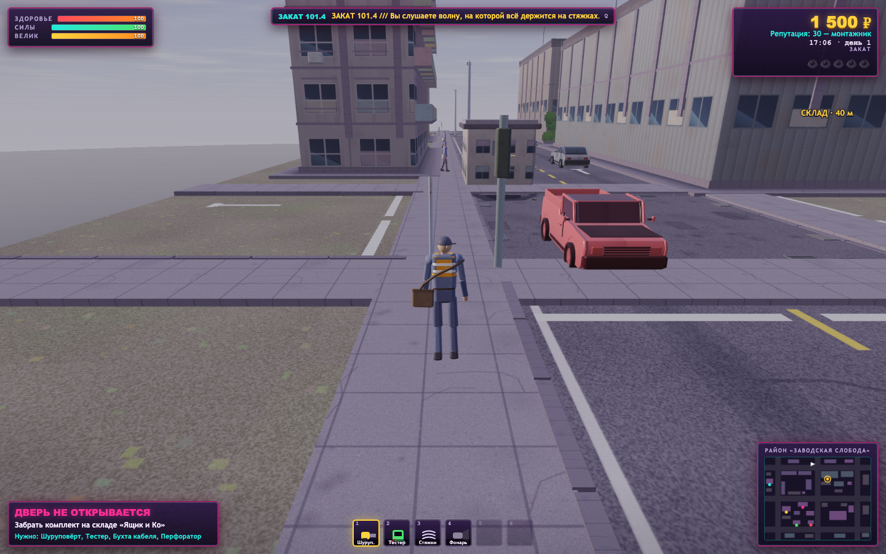
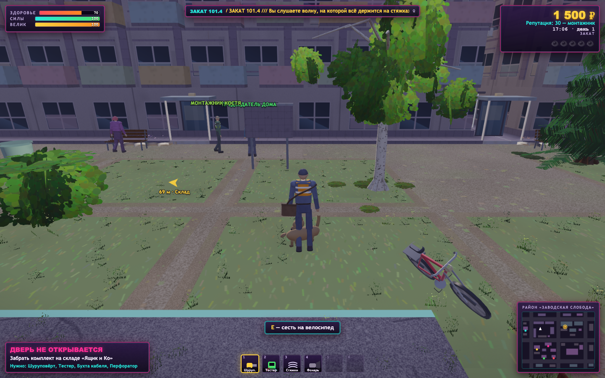
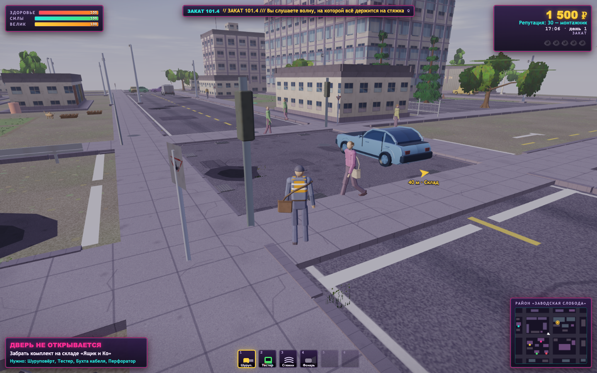

# Монтаж-Сити 3D — состояние рендера

Состояние после этапа 02 (каркас качества и текстуры). Этап 00 измерил и
разметил, этап 01 сделал оснастку запускаемой на Mac; здесь — карта файла,
устройство каркаса качества и текстур, контрольные сцены, метрики на целевой
машине (Mac mini M4, Chrome и WebKit) и узкие места по убыванию стоимости.
История по этапам — в [`RENDER-CHANGELOG.md`](RENDER-CHANGELOG.md).

---

## 1. Чем и как мерялось

Оснастка — в `games/montazh-city-3d/tools/`, подробности и все ключи в
`tools/README.md`:

| Файл | Что делает |
| --- | --- |
| `mac-baseline.sh` | Снимает всё одной командой: ставит недостающее, гоняет три сцены в двух браузерах, складывает сравнительную таблицу |
| `perf-inject.js` | Ставится в страницу **до** загрузки игры. Считает draw call'ы и треугольники по проходам, память под текстуры (включая массивы слоёв и sized-форматы) и буферы, время кадра, время GPU таймер-запросами, размер буфера отрисовки, границы фаз загрузки. Игру не правит ни строчкой |
| `perf-probe.mjs` | Гоняет три сцены в Playwright, снимает метрики и скриншоты, кладёт JSON в `docs/perf/`. Ключи `--quality` и `--dynamic` задают профиль и авто-масштаб |
| `perf-trace.mjs` | Сэмплирующий профилировщик V8 через CDP |
| `scenes.mjs` | Три контрольные сцены, файл сохранения и настройки — общий модуль для probe, trace и shot |
| `shot.mjs` | Снимок сцены за пятнадцать секунд с проверкой ошибок страницы, `gl.getError`, фаз загрузки по заданиям и памяти; точка и час — свои |
| `shot-stats.mjs` | Яркость и контраст кадра по полосам, монтаж «до \| после», без зависимостей |
| `compare.mjs` | Сводит два прогона в одну таблицу |
| `ext-probe.js` | Снимок возможностей WebGL2 для консоли настоящего Safari |
| `find-playwright.mjs` | Ищет playwright по всем обычным местам |
| `toc.mjs` | Пересобирает оглавление в начале `index.html`. `--check` — проверка без записи |

Перезамерить целиком — одна команда **из папки игры**:

```bash
cd <клон репозитория>/games/montazh-city-3d
bash tools/mac-baseline.sh          # база в двух браузерах, минут десять
node tools/perf-probe.mjs --scene=all --warmup=12 --measure=40 --profile=15 \
     --minFrames=60 --width=1440 --height=900 --dpr=2 --quality=medium \
     --shots=docs/shots/01-textures --out=docs/perf/01-textures-medium-chromium.json
node tools/compare.mjs docs/perf/00-base-mac-chromium.json \
     docs/perf/01-textures-medium-chromium.json --out=docs/perf/01-compare-medium.md
node tools/shot.mjs --scene=dense --quality=high --out=/tmp/dense.png   # быстрая проверка
node tools/toc.mjs --check
```

Три вещи, которые оснастка делает ради повторяемости:

* **Math.random посеян фиксированно**, иначе жители расставляются по-разному.
* **Сцена задаётся штатным сохранением игры** в `localStorage`; профиль
  качества и авто-масштаб — штатными настройками (`…_opt`).
* **Кадры с открытым диалогом выбрасываются**; время кадра считается только
  между соседями по исходной последовательности.

И одна, о которой надо помнить с этапа 02: **авто-масштаб в замере
выключен** (`--dynamic=0` по умолчанию). Иначе игра сама держит кадр в
бюджете, FPS упирается в частоту монитора, а меняется разрешение — сравнивать
нечего. Пока `perf-inject.js` держит свой запрос таймера, игра свой не
открывает; с `--dynamic=1` авто-масштаб под оснасткой работает по интервалам
кадров, как в WebKit.

### Где мерялось

Все цифры в этом документе сняты на целевой машине:

```
Mac mini M4, 10 ядер, дисплей 4608×2592 («как 2304×1296», dpr 2, 60 Гц)
Chromium 151.0.7922.34 (Playwright) — ANGLE Metal Renderer: Apple M4
WebKit 26.5 (Playwright)            — Apple GPU
```

Headless-режим Playwright не привязан к развёртке монитора: интервалы rAF в
Chromium гуляют от 7 до 26 мс, и FPS «по медиане кадра» там — про
планировщик, а не про игру. Честная цифра для Chromium — **время GPU по
`EXT_disjoint_timer_query_webgl2`**; в WebKit расширения нет, и кадр там
честно зажат развёрткой 60 Гц (17 мс). Замер этапа 00 шёл в контейнере на
SwiftShader; его цифры остались в журнале и переносятся только по форме
нагрузки.

---

## 2. Карта файла

Полная карта — комментарием в начале `games/montazh-city-3d/index.html`,
пересобирается `node tools/toc.mjs`. Крупными мазками (файл — 9153 строки):

| Строки | Что |
| ---: | --- |
| 119–285 | CSS: HUD, диалоги, экраны, мини-игры, заставка с полосой прогресса |
| 287–360 | Разметка: `canvas#gl`, слой HUD, диалог, экраны, заставка |
| 361–9150 | Вся игра одним IIFE. В `window` не торчит ничего |

По ролям:

| Роль | Строки |
| --- | --- |
| **Конфигурация качества** | 371–465 — `QCFG` и `Q`: профили, авто-масштаб, монитор, текстуры, цвет |
| **Рендер** | 550–820 (контекст и весь GLSL), 3792–4202 (`R3`, `Env` с линейными палитрами, `initRenderer`, `resizeGL`/`applyRenderSize`, `Perf`, `applyProfile`, `drawSky`, `beginMain`, `bindMaterial`/`drawMesh`, `drawStatic`), 8106–8349 (`drawDynamic`, `drawGlows`, `drawOverlay2D`, `renderFrame`) |
| **Текстуры** | 1295–2308 — `SURF_DEFS` (albedo + height + правила), карты, `sobelNormal`/`blurWrap`, массивы слоёв, `buildTexturesAsync`/`buildSignsAsync`/`rebuildTextures` |
| **Геометрия** | 821–1294 (класс `Mesh`), 2562–3566 (район), 3567–3791 (`buildWorld` — сборка батчей по имени материала), 4203–4662 (персонажи), 4663–4967 (транспорт) |
| **Физика** | 2478–2561, 6486–6683 |
| **Состояние** | 6361–6485 (`S.quality`, `S.dynamic` живут здесь) |
| **Интерфейс** | 5158–6293, 6741–6797, 8047–8105, 8350–8802 (настройки с переключателем качества — `screenSettings`) |
| **Сохранение** | 5113–5157 и 8803–8898 (`saveOpts`/`loadOpts`: `quality`, `dynamic`, прежний `lowFx`) |
| **Цикл** | 8899–9149 (`Loader`, асинхронный `boot`, `frame` с `Perf.frameTs/tick`) |

---

## 3. Каркас качества

### Блок конфигурации

`QCFG` — единственное место с числами качества. Что в нём:

| Ключ | Что задаёт |
| --- | --- |
| `profiles.low/medium/high` | `dprMax` (потолок плотности: 1 / 1.25 / 2), `scale` и `scaleMin` (стартовый и нижний масштаб рендера), `texSS` (холсты текстур: 1 → 256², 2 → 512²), `aniso` (4 / 8 / 16), `msaa`, `detail`, `lamps` и `lampPick` (источников в шейдере и фонарей в подборке), `glowR`, `vis` (множитель дальностей), `sparks`, `scan`, `veg` |
| `pickDefault(renderer, dpr)` | профиль новому игроку: Retina и Apple/RTX/Radeon — `high`, иначе `medium` |
| `dynamic` | бюджет 80 % интервала монитора, запас 60 %, 4 кадра вниз / 1.5 с вверх (3 с без таймера), шаг 0.05, сетка 0.025, пауза 350 мс, порог пропуска ×1.5, допустимая доля пропусков 5 %, планка 8 с |
| `display` | 48 интервалов на медиану, перемер раз в 15 с, список известных частот |
| `uiDprMax` | плотность слоя интерфейса (2) |
| `shader.maxLamps` | компилируемый предел источников (8) |
| `glow` | дальности свечений: 26 / 55 / 45 м, умножаются на `vis` |
| `tex` | размеры (256 / 512 / 256×64 / 128 логических), detail: повторов 7, 6–22 м, сила 0.55; AO: радиус 5 px, сила 2.0 |
| `color` | гамма 2.2 (остальные коэффициенты этапа 02 удалены вместе со старой моделью) |
| `light` | PBR: `sunK`, `vGlossK`, `roughMin`, `f0`, источники (радиус, радиус лампы, сила, цвета и множители), свечение окон, горизонтная и зеркальная окклюзия, вершинное затенение низа стен и кузовов, тени-блобы |
| `sky` | атмосфера (βR, βM, высоты, радиусы, g, яркость солнца, доля многократного рассеяния, число отсчётов), альбедо земли, ночное небо, положение солнца и луны, диск, звёзды, облака, туман |
| `env` | кубмапа 128², префильтр 64² на 6 уровнях, число отсчётов по уровням, шаг солнца для пересборки, сетка направлений для гармоник |
| `post` | формат HDR-буфера, потолок сэмплов, ключевые точки экспозиции день/закат/ночь, насыщенность, сила дизеринга |

`Q` — активный профиль, назначает `applyProfile(name, live)`.

### Масштаб рендера и авто-масштаб

С этапа 03 сцена рисуется не в холст, а в собственный HDR-буфер, и масштаб
живёт на нём: `HDR = холст × GL.scale`, холст всегда в полной плотности
(`GL.w × min(dprMax, devicePixelRatio)`), в него пишет проход тонмаппинга.
Слой интерфейса (`#hud2d`, DOM, мини-игры) — в `min(2, devicePixelRatio)`, от
масштаба не зависит.

Мультисэмплинг тоже свой: `renderbufferStorageMultisample` плюс
`blitFramebuffer` в текстуру. У контекста `antialias` выключен — его
мультисэмпл разрешается в холст, а нужно в текстуру.

`Perf` (раздел 7) крутит `GL.scale`:

1. **Частота монитора** — медиана 48 интервалов rAF, прижатая к ближайшей из
   известных частот (в пределах 8 %), перемер каждые 15 с. Бюджет кадра —
   80 % интервала.
2. **Время GPU** — запрос `TIME_ELAPSED_EXT` вокруг всей работы кадра
   (`renderFrame`), результат читается без ожидания, когда готов; при
   `GPU_DISJOINT_EXT` ожидающие запросы выбрасываются.
3. **Пропуски** — интервал длиннее 1.5 бюджета; считаются долей за 60
   кадров. При живом таймере пропуск учитывается, только если GPU занят
   хотя бы наполовину.

Шаг вниз — после 4 кадров подряд сверх бюджета, шаг крупнее при перерасходе
(до ×3). Шаг вверх — после 1.5 с с запасом (GPU < 60 % бюджета); без
таймера — после 3 с без пропусков. Между шагами пауза 350 мс, масштаб на
сетке 0.025. После «вверх и сразу вниз» планка держится 8 с.

Проверено в headless Chromium: буфер 5120×3200 → масштаб 0.775 за 2 с;
уменьшение окна → возврат к 1.0 за 8 с (по шагу каждые ~2 с).

### Что применяется когда

| Сразу, в игре | При следующем запуске |
| --- | --- |
| плотность, масштаб, анизотропия, число источников, дальности, частицы, полоски развёртки, **мультисэмплинг** (свой буфер, а не атрибут контекста), **размер текстур** (пересборка с полосой прогресса) | плотность зелени (`VEG` зашит в геометрию района) — игра предупреждает тостом |

Настройки → «Качество: …» перебирает профили, «Авто-масштаб» включает и
выключает контроллер, строка под кнопками показывает буфер, масштаб,
частоту монитора, бюджет, время GPU, длину кадра и число шагов.

---

## 4. Текстуры

### Комплект карт

| Группа | Материалы | Слои | Формат | Что внутри |
| --- | --- | ---: | --- | --- |
| `surf` 512² | asphalt, road, sidewalk, panel, stucco, brick, indust, garage, roof, ground, grass, bark, birch, metal, shopGlass | 15 | `SRGB8_ALPHA8` + `RGBA8` + `R8` | albedo (альфа — маска свечения окон), surf (nx, ny, roughness, metalness), ao |
| `cards` 1024² | leaves, roadsign | 2 | `SRGB8_ALPHA8` | albedo с альфа-тестом, растекание цвета под альфу (2 прохода) |
| `signs` 512×128 | 18 вывесок | 18 | `SRGB8_ALPHA8` | текст, альфа из яркости — маска свечения |
| `white` 8², `cloth` 256², `paint` 128² | заглушка, ткань, краска | 1 | `SRGB8_ALPHA8` | только albedo |
| `detail` 256² | зерно | 1 | `RGBA8` | нормаль высокой частоты в RG |

Размеры — при `texSS = 2` (среднее и высокое); на низком все холсты вдвое
меньше по стороне.

Материал (`TX[name]`) — `{ grp, layer, rough, metal, tri }`. Батчи района
хранят имя материала и берут `TX[name]` при каждом вызове, поэтому
пересборка текстур подменяет их разом.

### Как считаются карты

* **Высоты** рисуются той же кистью и с тем же посевом, что и цвет
  (`blotches`, `speckle`, `cracks`, `streaks`, окна) — серее ниже, белее
  выше; зерно (`hnoise`) кладётся в массив, минуя холст.
* **Нормаль** — Собель по замкнутому полю (тайлится), крутизна `bump` в
  описании материала, знак `ny` учитывает, что строки холста идут сверху
  вниз, а ось v — снизу вверх. В шейдере касательный базис строится из
  производных экрана (`perturb`): тангенсов в вершинах нет и не нужно.
  Ориентация проверена синтетическим тестом на тех же функциях.
* **AO** — `1 − clamp((blur(h) − h) × 2.0, 0, 0.85)`, размытие коробочное с
  заворотом, радиус 5 логических пикселей.
* **Roughness** — `база + k_h·(h − 0.5) + k_l·(яркость − 0.5)`; у профлиста
  и ворот шероховатость металла отдельная (`roughMetal`).
* **Metalness** — константа или маска (`metal(x, S)`): лист — металл,
  ржавчина и стёкла — нет.
* **Triplanar** (`tri` — шаг в метрах) — только у коры: три проекции от
  мировых координат, веса `|N|⁴`, нормали проекций в мировые оси.
* **Detail** — RG-нормаль 256² с повторами ×7, вес 0.55 до 6 м и до нуля к
  22 м.

### Цвет

Albedo в `SRGB8_ALPHA8` семплится линейно. Вершинные цвета, тинты, палитры
солнца, неба, тумана и фонарей — авторские, в sRGB — переводятся в
линейное пространство гаммой 2.2 (`lin1`/`lin3`, `pow` в вершинном
шейдере). Тонмаппинг: Рейнхард → плёночный носок → насыщенность →
**кодирование в sRGB** (`pow 1/2.2`). Экспозиция и коэффициенты
`sunK`/`ambK`/`skyK`/`fogK` подобраны по измеренной яркости контрольных
сцен: кадр в целом ±1–4 % от базы, небо светлее на 3–9 %, земля темнее на
1–3 %. Баланс света — этап 03.

---

## 4a. Свет, небо и окружение

Появилось на этапе 03. Числа — в `QCFG.light`, `QCFG.sky`, `QCFG.env`,
`QCFG.post`; в шейдерах чисел освещения нет.

### Порядок проходов кадра

    [грань кубмапы окружения или уровень префильтра — если солнце сдвинулось]
    → сцена в HDR-буфер:
        статика района  →  динамика (тени-блобы, машины, жители)
        →  небо ПОСЛЕДНИМ (полноэкранный треугольник на дальней плоскости,
           depthFunc LEQUAL: под домами шейдер неба не исполняется)
        →  свечения аддитивно
      invalidateFramebuffer(глубина)
    → resolve мультисэмпла блитом,  invalidateFramebuffer(мультисэмпловый цвет)
    → тонмаппинг в холст

Три смены буфера отрисовки; при выключенном мультисэмплинге две — сцена
тогда пишет прямо в текстуру.

### HDR-буфер

`R11F_G11F_B10F`, 2 сэмпла. Формат и число сэмплов выбраны замером (сцена 01,
высокий, GPU p50; база без HDR 3.92 мс): RGBA16F ×4 10.86 / ×2 6.86 / без
MSAA 5.21; R11F ×4 7.17 / ×2 5.99 / без MSAA 4.93. Расширения
`WEBGL_multisampled_render_to_texture` нет ни в Chromium, ни в WebKit, поэтому
мультисэмпл разрешается блитом через память — там и вся цена.

Подводные камни, на которых буфер молча не собирался и сцена не рисовалась:
у `R11F_G11F_B10F` внешний формат `RGB`, а не `RGBA`; пригодным для отрисовки
его делает `EXT_color_buffer_float`, а не `half_float`.

### Модель отражения

GGX, высотно-коррелированный Smith, Френель по Шлику, Ламберт с сохранением
энергии. Одна функция `directLight` на солнце и на точечные источники.
`F0 = mix(0.04, albedo, metalness)`, шероховатость и металличность из карт,
`vGloss` из вершин — модификатор шероховатости. Интеграл BRDF — аналитическое
приближение Кариса, таблицы BRDF нет.

Точечные источники: спад обратный квадрату с оконной функцией на радиусе и
радиусом самого светильника. Сила выведена приравниванием к прежнему
линейному спаду на восьми и на четырнадцати метрах.

### Небо

Однократное рассеяние Рэлея и Ми, восемь отсчётов по лучу и четыре к солнцу,
плюс приближение многократного рассеяния `(1 − exp(−βR·od))` — без него
горизонт в полдень жёлто-зелёный. Цвет и сила прямого солнца — прозрачность
атмосферы вдоль луча на солнце; палитр солнца, неба, земли и тумана больше
нет. Высота солнца честно уходит в минус, «ночь» считается из неё.

Считается в кубмапу 128² по грани за кадр при сдвиге солнца на 1.5° (при
игровых сутках в 40 минут — раз в десять секунд). Из кубмапы кормятся фон,
туман по направлению взгляда, зеркальные отражения и рассеянный свет.

**Формула живёт в двух исполнениях** — GLSL для кубмапы и JS для сферических
гармоник (кубмапу обратно читать нельзя). Их сходимость проверяет
`tools/sky-test.mjs`: сейчас максимум 0.025 %, в среднем 0.001 %. Тронул
модель — прогони тест.

### Окружение

Префильтр GGX по шести уровням шероховатости, 64² с мипами. Сферические
гармоники L2 считаются на CPU по той же аналитической функции. Материалы
берут рассеянное из гармоник, зеркальное из префильтра, с зеркальной
окклюзией из AO и горизонтной окклюзией.

### Постобработка

Экспозиция по ключевым точкам день/закат/ночь (автоэкспозиции нет намеренно),
ACES, насыщенность, кодирование в sRGB, дизеринг треугольным шумом. Всё —
один раз, в одном проходе.

Свечения-спрайты и светящиеся окна авторские, в экранных единицах: в HDR они
делятся на экспозицию кадра, иначе ночью выбиваются в белое.

---

## 5. Контрольные сцены

Пять штук, описания и координаты — в `tools/scenes.mjs`. Три дневные (17:00)
и две ночные (22:00). Ночные добавлены на этапе 03: до них все сцены
снимались в 17:00, когда `uLampN = 0` и ветка точечных источников в шейдере
не исполняется — половина модели света была без замера.

Все три — 17:00 первого дня (`clock = 61200`), камера за спиной, инструменты
в сумке. Время суток одно: `Env.night = 0`, фонари не горят, свет во всех трёх
сценах один и тот же. Задаются `tools/scenes.mjs`.

### 01 · Открытая улица

* **Где.** Северная магистраль (дорога `z = 18.75`), северный тротуар, точка
  `x = 90, z = 12.25`, взгляд на восток вдоль улицы (`yaw = π/2`).
* **Зачем.** Самая длинная простреливаемая дистанция и много неба: дальность
  отрисовки, туман, заливка небесного прохода.



### 02 · Плотная застройка

* **Где.** Двор «Три Колена», точка `x = 50, z = 45`, взгляд на север
  (`yaw = π`).
* **Зачем.** Стена «Панельной 12» закрывает верх кадра, низ и края забиты
  клёном, кустами и изгородью — альфа-тест и `discard`. Точка в 15 м от
  Клянчилы: ближе он открывает диалог и мир встаёт.



### 03 · Техника в движении

* **Где.** Перекрёсток дорог `x = 100` и `z = 75`, угловой тротуар
  `x = 93, z = 70.5`, взгляд на перекрёсток (`yaw = 1.05`).
* **Зачем.** Обе оси движения в кадре: машины, люди, отдельный проход теней.



Кадры «после» — `shots/01-textures/` (среднее) и `shots/01-textures-high/`
(высокое); монтажи «до | после» — `shots/01-textures/cmp-*.png`.

---

## 6. Метрики

Окно 1440×900 CSS при `devicePixelRatio = 2`. Прогрев 12 с, окно замера 40 с
и не меньше 60 чистых кадров, авто-масштаб выключен. Ошибок на странице во
всех прогонах — ноль. **Сравнивать надо по GPU p50**: p95 в headless
бимодален (два горба, 3 и 8 мс), в headed при 60 Гц распределение
одногорбое, p95/p50 = 1.26 — то есть бимодальность headless-вывода, а не
поведение GPU.

GPU p50, миллисекунды. «База» — состояние до этапа 03 (после этапа 02).

| Сцена | Высокий: база → сейчас | Средний: база → сейчас | WebKit FPS |
| --- | ---: | ---: | ---: |
| 01 · открытая улица | 3.92 → 6.24 | 2.87 → 3.34 | 58.8 |
| 02 · плотная застройка | 4.26 → 7.57 | 3.06 → 3.37 | 58.8 |
| 03 · техника в движении | 4.99 → 8.04 | 3.20 → 3.47 | 58.8 |
| 04 · ночная улица | 5.00 → 7.20 | 3.15 → 3.84 | 58.8 |
| 05 · ночные витрины | 4.74 → 6.93 | 3.60 → 4.42 | 58.8 |

Буфер сцены: высокий 2880×1800, средний 1800×1126. Draw call'ов 93–152,
треугольников 167–232 тысячи, главный поток меньше миллисекунды.

Бюджет при 60 Гц и `budgetFrac` 0.80 — 13.3 мс. Свободно на высоком примерно
6 мс, на среднем примерно 9.

Разброс между прогонами одной и той же сцены доходит до 1 мс: сцена 03 в
соседних чистых прогонах дала 6.83 и 8.04. Считать её стоящей на границе.

### Headless занижает время GPU

Замеры выше сняты в headless. Сравнение с headed на тех же сценах и том же
профиле (собственный таймер игры, `tools/scale-probe.mjs`):

| Сцена | headless | headed | занижение |
| --- | ---: | ---: | ---: |
| 01 · открытая улица | 6.24 | 7.65 | 18 % |
| 03 · техника в движении | 8.04 | 9.14 | 12 % |
| 05 · ночные витрины | 6.93 | 8.99 | 23 % |

**Настоящая цена кадра на высоком профиле — 7.7–9.1 мс из бюджета 13.3.**
Свободно 4.2–5.6 мс, а не 5–7, как выходит по headless. Планировать
следующие этапы надо от headed-цифр.

### Авто-масштаб

**В настоящем браузере контроллер не срабатывает.** Headed, высокий профиль,
40–45 с на сцену: пропущенных кадров ноль на всех трёх проверенных сценах,
шагов вниз ноль, буфер остаётся 2880×1800. Единственный наблюдённый шаг —
вверх, с 0.95 к 1.0 на сцене 05 (восстановление после старта).

**В headless контроллер срабатывает ложно** — и это не артефакт замерной
обвязки, а поведение самого контроллера. Проверено инструментом, который
телеметрию не ставит вовсе и отдаёт таймер игре: на сцене 03 двенадцать
шагов вниз до 0.6, на сцене 05 девять шагов до 0.675 — при GPU 5.1–6.5 мс,
то есть вдвое ниже бюджета. Причина в ветке подстраховки:

```js
if (dropped && this.gpuAvg > budget * 0.5) { over = true; }
```

В headless интервалы rAF гуляют от 7 до 26 мс, доля «пропущенных» кадров
11–12 %, и они кучкуются; четырёх подряд хватает на шаг вниз. Ворота
`gpuAvg > budget/2` на высоком профиле открыты (6.4 против 5.5), на среднем
закрыты (3.6 против 5.5) — поэтому на среднем в том же headless масштаб не
двигается. В браузере с вертикальной синхронизацией пропусков нет вовсе (за
45 с — ноль), и ветка не срабатывает.

**Практический вывод:** проверять авто-масштаб только в headed и только
через `tools/scale-probe.mjs`; цифры буфера из `perf-probe --dynamic=1` в
headless ничего не значат.

---

## 7. Разбор кадра по проходам и как он мерялся

**Способ — префиксы по таймер-запросам.** Один `TIME_ELAPSED_EXT` на кадр,
от начала кадра до конца прохода k; k перебирается по кадрам; цена прохода —
разность медиан соседних префиксов. Искусственная граница запроса в каждом
замере одна и примерно одинаковая, поэтому в разности она сокращается.
Последний префикс равен кадру целиком и сходится с обычным замером в пределах
4 % — встроенная проверка метода. Слот k = −1 меряет пустой префикс. Рядом
печатается межквартильный размах: проход дешевле него уходит в разности в
минус, и так и печатается.

**Чего делать нельзя.** Прямой способ — запрос на каждый проход — на M4 даёт
мусор: шесть запросов в кадре показали сумму 32 мс при кадре 4.4 мс, а
«очистка» из одного `gl.clear` — 1.8 мс. Каждая граница запроса заставляет
тайловый GPU сохранить буфер 2880×1800 в память и загрузить обратно. `readPixels`
на границах проходов ломается по той же причине и остаётся только запасным
способом для WebKit, где таймера нет вовсе (там разрешение таймера 1 мс и
таблица бесполезна).

**Программы опознаются по метке** `/* PASS:имя */` в исходнике шейдера.
Сейчас их семь: `main` в двух вариантах (день и ночь), `sky`, `glow`, `tone`,
`env` в двух (кубмапа неба и префильтр).

Разбор кадра, высокий профиль, медианы разностей префиксов, мс:

| Сцена | статика | динамика | небо | тени | свечения | тонмаппинг | остаток |
| --- | ---: | ---: | ---: | ---: | ---: | ---: | ---: |
| 01 | 2.90 | 0.03 | 0.22 | 0.01 | 0.77 | 0.77 | 1.55 |
| 02 | 3.43 | 0.21 | 0.24 | 0.03 | 1.01 | 0.63 | 1.76 |
| 03 | 3.56 | 0.34 | −0.04 | −0.07 | 1.02 | 0.80 | 1.78 |
| 04 | 3.04 | 0.11 | 0.24 | 0.04 | 0.66 | 0.66 | 1.17 |
| 05 | 3.64 | 0.02 | 0.16 | 0.08 | 0.71 | 0.69 | 1.53 |

«Остаток» — очистка, установка камеры и разгон конвейера; туда же попадает
искусственная граница запроса. Проход окружения (грань кубмапы или уровень
префильтра) появляется раз в десять секунд игрового времени и в медиану не
попадает.

---

## 8. Загрузка, генерация текстур и память

### Время загрузки

Отметки изнутри страницы, от начала скрипта до конца заставки (с этапа 02 загрузка отдаёт кадры браузеру, и «первый rAF» приходит посреди неё), тёплый запуск
(шейдеры в кэше; холодный первый запуск Chromium добавляет ≈250 мс на
компиляцию трёх программ — ANGLE делает это на первой отрисовке).

| Фаза, мс (двор, тёплый запуск) | База · Chromium | После · Chromium · среднее | После · Chromium · высокое | База · WebKit | После · WebKit · среднее |
| --- | ---: | ---: | ---: | ---: | ---: |
| Инициализация GL и HUD | 37 | 37 | 45 | 31 | 32 |
| Генерация текстур | 158 | 348 | 344 | 130 | 452 |
| Геометрия района | 56 | 33 | 33 | 59 | 35 |
| Вывески | 0 | 20 | 23 | 0 | 17 |
| Персонажи и техника | 25 | 27 | 24 | 25 | 22 |
| **До конца загрузки** | 285.6 | 475.4 | 481 | 255 | 569 |

Генерация текстур на M4 подорожала вдвое: полный комплект карт для 15
материалов — два холста, три выгрузки пикселей, Собель, размытие и упаковка
на каждый. Она идёт заданиями между кадрами с полосой прогресса, вкладка не
висит; профиль `low` (`texSS = 1`) вчетверо дешевле. Самые дорогие задания:
первый материал (прогрев JIT, ≈50–60 мс), road, атлас зелени (растекание
цвета под альфу на 1024², ≈30 мс), атлас знаков (≈25 мс).

### Память

| | База | После |
| --- | ---: | ---: |
| Текстур (объектов GL) | 39 | 9 |
| Нулевой уровень, МиБ | 27.9 | 46.8 |
| С мип-уровнями, МиБ | 37.2 | 62.4 |
| Буферы геометрии, МиБ | 17.0 | 17.0 |
| **Итого на GPU, МиБ** | **54.2** | **79.4** |

Разбор «после» по группам (при `texSS = 2`, с мипами):

| Текстура | Размер | Формат | МиБ |
| --- | --- | --- | ---: |
| `surf.albedo` | 512²×15 | `SRGB8_ALPHA8` | 20.0 |
| `surf.surf` | 512²×15 | `RGBA8` | 20.0 |
| `surf.ao` | 512²×15 | `R8` | 5.0 |
| `cards` | 1024²×2 | `SRGB8_ALPHA8` | 10.7 |
| `signs` | 512×128×18 | `SRGB8_ALPHA8` | 6.0 |
| `cloth`, `paint`, `white`, `detail` | 256², 128², 8², 256² | | 0.7 |
| **Итого** | | | **62.4** |

Пять отдельных RGBA8-карт на материал дали бы ≈180 МиБ; упаковка в
`albedo + surf + ao` и albedo-only для карт, вывесок и мелочи держит
рост в 1.7 раза. Буферы геометрии не менялись: 17.0 МиБ.

---

## 9. Расширения WebGL2

| Расширение | Chromium 151 / M4 | WebKit 26.5 / M4 | Зачем |
| --- | :---: | :---: | --- |
| `EXT_texture_filter_anisotropic` | есть (max 16) | есть (max 16) | анизотропия из профиля, 4/8/16 |
| `EXT_disjoint_timer_query_webgl2` | **есть** | **нет** | время GPU для авто-масштаба и замера; в WebKit авто-масштаб живёт на интервалах кадра |
| `EXT_color_buffer_float` / `_half_float` | есть | есть | HDR-буфер, если понадобится этапу 03 |
| `OES_texture_float_linear` | есть | есть | |
| `WEBGL_debug_renderer_info` | есть | есть | `pickDefault` узнаёт GPU |
| `KHR_parallel_shader_compile` | есть | есть | при трёх программах не нужно |
| `WEBGL_multi_draw` | есть | есть | схлопнуть батчи района |
| `WEBGL_compressed_texture_s3tc` / `_astc` / `EXT_texture_compression_bptc` | есть | есть | не используются: кодировщик пришлось бы тащить в файл |

Пределы: `MAX_TEXTURE_SIZE 16384`, `MAX_SAMPLES 4`, `MAX_VARYING_VECTORS 30`.

Всё, что этап 02 использует сверх ядра WebGL2, — анизотропия и таймер —
проверяется при запуске и деградирует без ошибок: без анизотропии дорога
вдаль мылится, без таймера авто-масштаб считает пропуски кадров.

Настоящий Safari (не WebKit из Playwright) по-прежнему не снят: процедура —
`tools/ext-probe.js` в консоль веб-инспектора, пять минут.

---

## 10. Chrome против Safari

Сравнение выполнено, обе стороны — на одной машине.

* **Расширения.** Единственная существенная разница — таймер-запросы:
  у WebKit их нет. Остальной набор совпадает, включая сжатые форматы и
  `WEBGL_multi_draw`.
* **Кадр.** WebKit держит ровные 17 мс (58.8 FPS, p95 17–18 мс) во всех
  сценах и в обоих прогонах — развёртка 60 Гц. Chromium в headless-режиме
  не привязан к развёртке, поэтому его FPS сравнивать с WebKit нельзя; по
  GPU-таймеру кадр в Chromium стоит 2.3–3 мс на среднем профиле, то есть в
  четыре-пять раз дешевле развёртки. Гипотеза этапа 00 про дорогие смены
  состояния через ANGLE→Metal не подтвердилась и не опровергнута: разложить
  кадр WebKit по проходам нечем.
* **Загрузка.** Генерация текстур в WebKit быстрее на 15–20 % (canvas 2D у
  него дешевле), остальное совпадает.

---

## 11. Узкие места, по убыванию стоимости

1. **Весь район рисуется каждый кадр целиком.** `drawStatic` отправляет 36
   вызовов на любой сцене — отсева нет. Это 2.9–3.6 мс, то есть 43–54 %
   кадра, и главный расход после этапа 03. Проход теней умножит это на число
   каскадов, поэтому отсев по клеткам становится обязательным условием
   следующего этапа, а не пожеланием.
2. **Свечения-спрайты** — 0.66–1.02 мс при 30–50 вызовах по одному кваду со
   сменой программы. Схлопнуть в инстансированный вызов.
3. **Тонмаппинг** — 0.63–0.80 мс: полноэкранный проход по 2880×1800. Дешевле
   не станет, но в него можно вложить будущие эффекты, а не плодить проходы.
4. **Разрешение мультисэмпла блитом** — входит в «остаток» и в проход,
   предшествующий тонмаппингу. Расширения
   `WEBGL_multisampled_render_to_texture` нет ни в Chromium, ни в WebKit,
   поэтому обмен идёт через память. Именно поэтому формат буфера в четыре
   байта вместо восьми сэкономил 1.2 мс.
5. **Ночной цикл по восьми источникам** — днём его нет вовсе (отдельный
   вариант программы), ночью он и даёт разницу между 6.2 и 7.2 мс на той же
   точке.
6. **Генерация текстур** — 593 мс до конца сборки района, конец заставки
   702 мс.
7. **Главный поток свободен** (<1 мс), JS оптимизировать незачем.

Что уже в порядке и трогать не надо: плотность пикселей и масштаб под
контролем профилей; батчи по материалу; все текстуры с мипами и
анизотропией; персонажи скиннятся на GPU; интерфейс в полной плотности
отдельно от сцены; тонмаппинг ровно один; проход неба стоит 1.5–4.7 % кадра
и считается только там, где небо видно.

---

## 12. Что дальше

1. **Тени и затенение** (этап 04): каскадные теневые карты от солнца, SSAO.
   Промт готов — `docs/RENDER-STAGE-04-PROMPT.md`. Главное ограничение там:
   мультисэмпловую глубину в ES 3.0 нельзя разрешить блитом, значит SSAO
   требует либо отдельного прохода глубины, либо отказа от мультисэмплинга —
   выбирать замером.
2. **Отсев статики по клеткам и пирамиде видимости** — перенесён в этап 04
   как его условие.
3. **Схлопнуть свечения и тени-блобы** в инстансированный вызов.
4. Проверить полосы на ночном небе количественно уже на гладкой модели:
   прежняя проверка делалась на старом fbm-небе.
5. Снять настоящий Safari через `tools/ext-probe.js`.
6. Посторонняя находка этапа 03: текст вывесок на фасадах со стороны
   `side: 'S'` читается зеркально. К рендеру отношения не имеет.
