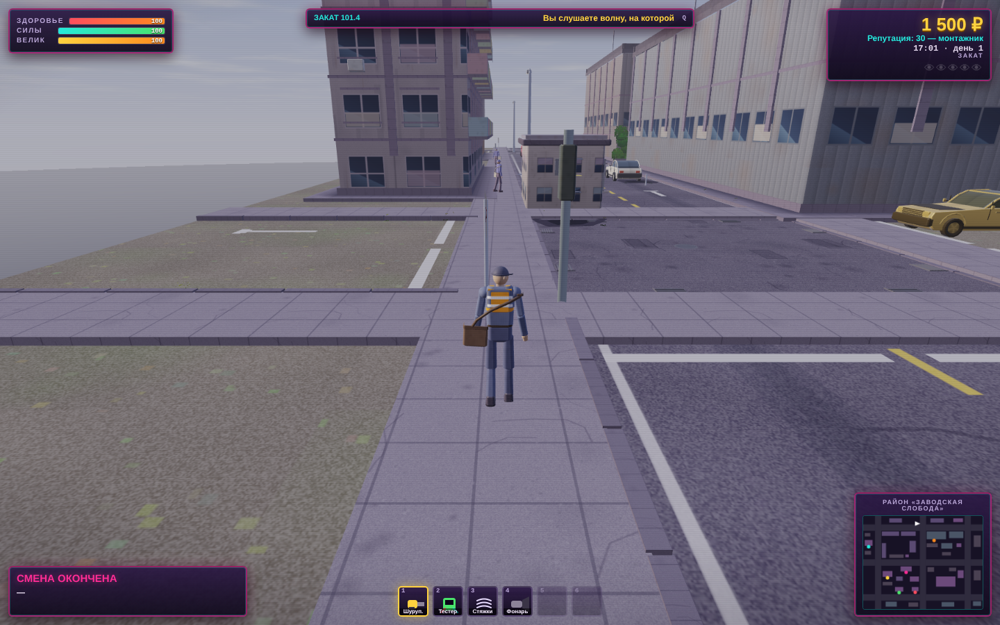
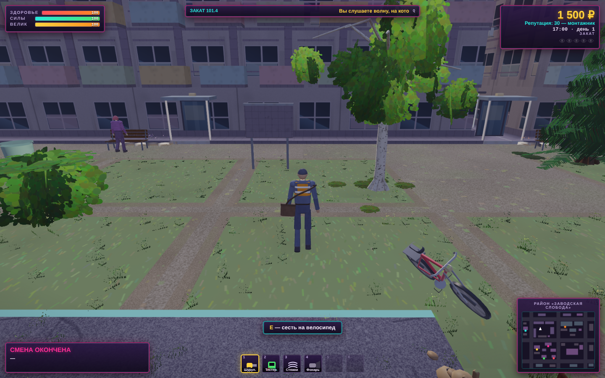
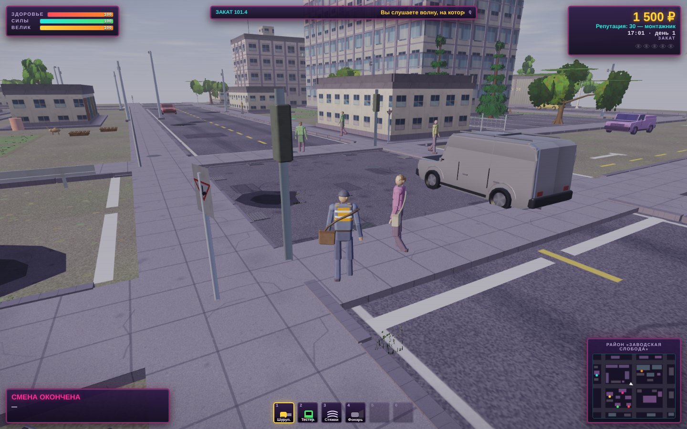

# Монтаж-Сити 3D — состояние рендера

Этап 00: замерить и разметить. В игре не менялось ничего, кроме оглавления
комментарием в начале `games/montazh-city-3d/index.html`.

Здесь лежит всё, от чего будут отталкиваться следующие этапы: карта файла, три
контрольные сцены с точным способом в них попасть, базовые цифры, разбор кадра
по проходам, список расширений WebGL2 и узкие места по убыванию стоимости.

---

## 1. Чем и как мерялось

Оснастка — в `games/montazh-city-3d/tools/`, подробности и все ключи в
`tools/README.md`:

| Файл | Что делает |
| --- | --- |
| `mac-baseline.sh` | Снимает всё одной командой: ставит недостающее, гоняет три сцены в двух браузерах, складывает сравнительную таблицу |
| `perf-inject.js` | Ставится в страницу **до** загрузки игры. Считает draw call'ы и треугольники по проходам, память под текстуры и буферы, время кадра, границы фаз загрузки. Игру не правит ни строчкой |
| `perf-probe.mjs` | Гоняет три сцены в Playwright, снимает метрики и скриншоты, кладёт JSON в `docs/perf/` |
| `perf-trace.mjs` | Сэмплирующий профилировщик V8 через CDP — то же, что вкладка Performance в DevTools, только без ручной работы |
| `compare.mjs` | Сводит два прогона в одну таблицу: кадр, вызовы, проходы, расширения, память |
| `ext-probe.js` | Снимок возможностей WebGL2. Вставляется в консоль любого браузера — им снимается настоящий Safari, куда автоматика не дотягивается |
| `find-playwright.mjs` | Ищет playwright по всем обычным местам, чтобы не пришлось выставлять `NODE_PATH` |
| `toc.mjs` | Пересобирает оглавление в начале `index.html`. `--check` — проверка без записи |

Перезамерить целиком — одна команда **из папки игры**, не из домашней:

```bash
cd <клон репозитория>/games/montazh-city-3d
bash tools/mac-baseline.sh          # весь замер, минут десять
bash tools/mac-baseline.sh --dry    # только проверить, что всё на месте
```

Скрипт не зависит от текущей папки и сам ищет `playwright` — ни `cd` в нужное
место, ни `NODE_PATH` выставлять не требуется.

Он же по частям, если нужно точечно:

```bash
node tools/perf-probe.mjs --scene=all --warmup=12 --measure=40 --profile=15 \
     --minFrames=60 --width=1440 --height=900 --dpr=2 \
     --shots=docs/shots/00-base --out=docs/perf/base-chromium-1440x900-dpr2.json
node tools/perf-trace.mjs --scene=dense --seconds=20
node tools/compare.mjs docs/perf/mac-chromium.json docs/perf/mac-webkit.json \
     --out=docs/perf/mac-compare.md
node tools/toc.mjs --check
```

Три вещи, которые оснастка делает ради повторяемости и о которых стоит знать:

* **Math.random посеян фиксированно.** Иначе прохожие, собаки и хулиганы
  расставляются по-разному и сцены не сравнить между прогонами.
* **Сцена задаётся штатным сохранением игры.** Оснастка кладёт в
  `localStorage` готовый файл сохранения с нужными координатами, поворотом и
  временем суток, потом жмёт «Продолжить». Никаких отладочных крючков в игре
  для этого не понадобилось.
* **Кадры с открытым диалогом выбрасываются.** Пока висит диалог, `step()` не
  вызывает `updateWorld`, машины стоят, и такой кадр — про паузу, а не про
  сцену. Время кадра считается только между соседями по исходной
  последовательности, иначе выброшенный кусок склеился бы в один «кадр» на всю
  паузу и p95 показал бы секунды.

### Где мерялось — и почему абсолютные цифры не про Mac

Замер выполнен в **линуксовом контейнере без графического ускорителя**:

```
CPU        Intel Xeon @ 2.10GHz, 4 ядра
GPU        нет (/dev/dri отсутствует)
Браузер    Chromium 141.0.7390.37 (Playwright)
Рендерер   ANGLE (Google, Vulkan 1.3.0 (SwiftShader Device (Subzero)), SwiftShader driver)
```

`SwiftShader` — программный растеризатор. Отсюда три прямых следствия, и их
надо держать в голове, читая любые цифры ниже:

1. **FPS и время кадра к Mac mini M4 не переносятся никак.** 1.5–2.7 кадра в
   секунду — это скорость софтверной растеризации на четырёх ядрах Xeon, а не
   свойство игры. Переносится **форма** нагрузки: во что упирается кадр и в
   какой пропорции.
2. **`EXT_disjoint_timer_query_webgl2` в этой сборке отсутствует**, поэтому
   замерить проход таймер-запросами, как надо, здесь физически нечем. Как
   выкрутились — в разделе 6; поддержка таймер-запросов в оснастке написана и
   включится сама, как только расширение появится.
3. **Safari на Linux не существует**, а сборка WebKit для Playwright в этом
   окружении не установлена (`playwright install` запускать нельзя). Сравнение
   Chrome и Safari **не выполнено** — см. раздел 8, там лежит готовая процедура
   на пять минут.

Что переносится на Mac без оговорок: карта файла, контрольные сцены, число
draw call'ов, число треугольников, объём памяти под текстуры и буферы, состав
проходов кадра, время генерации текстур и сборки геометрии (это чистый CPU и
canvas 2D), список узких мест в коде.

---

## 2. Карта файла

Полная карта — комментарием в начале `games/montazh-city-3d/index.html`,
пересобирается `node tools/toc.mjs`. Крупными мазками (строки на момент
замера, файл — 8401 строка):

| Строки | Что |
| ---: | --- |
| 117–281 | CSS: HUD, диалоги, экраны, мини-игры |
| 283–356 | Разметка: `canvas#gl`, слой HUD, диалог, экраны, заставка загрузки |
| 357–8398 | Вся игра одним IIFE. В `window` не торчит ничего |

По ролям:

| Роль | Строки |
| --- | --- |
| **Рендер** | 448–663 (контекст и весь GLSL), 3247–3474 (`R3`, `Env`, `drawSky`, `beginMain`, `drawMesh`, `drawGlow`, `drawStatic`), 7378–7625 (`drawDynamic`, `drawGlows`, `drawOverlay2D`, `renderFrame`) |
| **Генерация текстур** | 1138–1766 — весь canvas 2D: асфальт, панели, кирпич, профлист, витрины, атлас зелени, вывески |
| **Геометрия** | 664–1137 (класс `Mesh`), 2020–3024 (район: дорога, фасады, растительность), 3025–3246 (`buildWorld` — сборка батчей), 3475–3744 (модели персонажей), 3935–4239 (транспорт) |
| **Анимация** | 3745–3934 (`poseCharacter`, `drawCharacter` — скелет на 20 костей), 6070–6609 (`charPose`, `tickGait`, поведение жителей), 5956–6012 (камера) |
| **Физика** | 1936–2019 (список AABB + равномерная сетка 8 м), 5758–5955 (движение Олега и велосипеда) |
| **Интерфейс** | 4430–4586 (диалоги), 4587–5444 (мини-игры), 5445–5565 (радио), 6013–6069 (2D-слой поверх сцены), 7626–8074 (HUD, миникарта, экраны) |
| **Прочее** | 4240–4384 звук, 4385–4429 и 8075–8168 сохранение, 5566–5632 ввод, 5633–5757 состояние, 6610–7318 заявки, 8169–8397 мир и цикл |

Нумерация разделов внутри файла историческая и местами сбита: номер 23 занят
дважды (мини-игра двери и взаимодействие), часть разделов без номера.
Ориентироваться надо на строки. Переименовывать не стал — это правка в игре, а
этап про замер.

---

## 3. Контрольные сцены

Все три — 17:00 первого дня (`clock = 61200`), полные эффекты (`lowFx = false`),
камера за спиной, инструменты в сумке. Одинаковое время суток выбрано нарочно:
`Env.night = 0`, фонари не горят, свет во всех трёх сценах один и тот же —
иначе сравнивать было бы нечего.

### 01 · Открытая улица

* **Где.** Северная магистраль (дорога `z = 18.75`), северный тротуар, точка
  `x = 90, z = 12.25`, взгляд на восток вдоль улицы (`yaw = π/2`).
* **Зачем.** Самая длинная простреливаемая дистанция в районе и много неба.
  Проверяет дальность отрисовки, туман и заливку небесного прохода.
* **Как попасть руками.** Новая смена → выйти на верхнюю дорогу района и
  встать на северный тротуар примерно посередине карты, лицом на восток. По
  миникарте — верхняя горизонтальная дорога, середина.



### 02 · Плотная застройка

* **Где.** Двор «Три Колена», точка `x = 45, z = 45`, взгляд на север
  (`yaw = π`).
* **Зачем.** Стена «Панельной 12» закрывает верх кадра, низ и левый край забиты
  клёном, кустами и живой изгородью — а это альфа-тест и `discard`. Худший
  случай сразу и по геометрии, и по прозрачным пикселям.
* **Почему именно эта точка.** 21 м до Клянчилы и 30 м до Щипача. Ближе они
  подходят знакомиться, открывают диалог, мир встаёт — первая версия сцены
  стояла в 6 м от Клянчилы, и всё окно замера ушло в разговор.
* **Как попасть руками.** Двор между панельными домами 12 и 14, встать у
  кустов западнее песочницы, лицом к подъездам.



### 03 · Техника в движении

* **Где.** Перекрёсток дорог `x = 100` и `z = 75`, угловой тротуар
  `x = 93, z = 70.5`, взгляд на перекрёсток (`yaw = 1.05`).
* **Зачем.** В кадре сразу обе оси движения: машины идут по четырём полосам и
  не останавливаются, по тротуарам ходят люди, вдали стоит БЦ «Панельный
  Титан». Проверяет цену анимации техники и людей и отдельного прохода теней.
* **Как попасть руками.** Центральный перекрёсток района, встать на юго-западный
  угол тротуара лицом на перекрёсток.



---

## 4. Базовые метрики

Снято 2026-09-04, Chromium 141 / SwiftShader, окно 1440×900 CSS при
`devicePixelRatio = 2`. Игра сама режет плотность до 1.25, поэтому реальный
буфер отрисовки — **1800×1125**. Прогрев 12 с, окно замера — не меньше 40 с и
не меньше 60 чистых кадров. Ошибок на странице за все прогоны: **ноль**.

| | Открытая улица | Плотная застройка | Техника в движении |
| --- | ---: | ---: | ---: |
| **FPS (по медиане кадра)** | 2.73 | 1.94 | 2.07 |
| **FPS (среднее)** | 2.68 | 1.94 | 2.08 |
| **Время кадра, p50** | 366.7 мс | 516.6 мс | 483.3 мс |
| **Время кадра, p95** | 400.0 мс | 533.4 мс | 500.1 мс |
| Время кадра, p99 | 400.0 мс | 550.0 мс | 516.7 мс |
| Время кадра, минимум | 349.9 мс | 466.7 мс | 433.3 мс |
| Время кадра, максимум | 433.3 мс | 566.6 мс | 516.7 мс |
| **Главный поток, p50** | 1.5 мс | 1.9 мс | 1.6 мс |
| Главный поток, p95 | 2.2 мс | 5.7 мс | 4.2 мс |
| **Draw call'ов, p50** | 96 | 115 | 132 |
| Draw call'ов, p95 | 100 | 115 | 135 |
| — из них небо | 1 | 1 | 1 |
| — основная программа | 62.9 | 71.0 | 82.7 |
| — тени и свечения | 31.1 | 39.4 | 47.0 |
| **Треугольников, p50** | 173 100 | 197 032 | 226 048 |
| Треугольников, p95 | 178 596 | 197 096 | 228 862 |
| Интервалов в выборке | 60 | 60 | 61 |

Разброс между p50 и p95 — 9 %, 3 % и 3.5 %. Провалов нет: кадр ровный, узкое
место одно и постоянное. Это само по себе полезно — значит, оптимизировать
надо не всплески, а среднюю стоимость.

**Ещё раз: абсолютные значения FPS относятся к программному растеризатору на
четырёхъядерном Xeon и к Mac mini M4 отношения не имеют.** Читать надо
пропорции: сколько кадра на каком проходе, сколько геометрии отправляется зря,
сколько занимает главный поток.

Про «главный поток» стоит сказать отдельно, потому что это самая переносимая
цифра в таблице: своя работа игры в JS занимает **1.5–1.9 мс на кадр**. Если
представить целевые 60 FPS с бюджетом 16.7 мс, это 9–11 % — на медленном Xeon.
На M4 будет заметно меньше.

---

## 5. Разбор кадра по проходам

Медианы по кадрам под профилировкой. Метод — раздел 6.

### Открытая улица · сумма проходов 371.5 мс при кадре 366.7 мс

| Доля | Время | Вызовов | Треугольников | Проход |
| ---: | ---: | ---: | ---: | --- |
| **66.6 %** | 247.5 мс | 36 | 98 701 | Статика района |
| 17.6 % | 65.5 мс | 1 | 1 | Небо |
| 11.3 % | 41.8 мс | 28 | 77 016 | Персонажи и техника |
| 2.1 % | 7.7 мс | 0 | 0 | Очистка и служебное |
| 1.3 % | 4.9 мс | 6 | 12 | Свечения и маркеры |
| 1.1 % | 4.1 мс | 27 | 54 | Тени под объектами |

### Плотная застройка · сумма 508.3 мс при кадре 516.6 мс

| Доля | Время | Вызовов | Треугольников | Проход |
| ---: | ---: | ---: | ---: | --- |
| **73.5 %** | 373.5 мс | 36 | 98 701 | Статика района |
| 13.0 % | 65.9 мс | 1 | 1 | Небо |
| 10.4 % | 53.1 мс | 36 | 98 190 | Персонажи и техника |
| 1.4 % | 7.3 мс | 0 | 0 | Очистка и служебное |
| 0.9 % | 4.4 мс | 6 | 12 | Свечения и маркеры |
| 0.8 % | 4.1 мс | 36 | 72 | Тени под объектами |

### Техника в движении · сумма 479.5 мс при кадре 483.3 мс

| Доля | Время | Вызовов | Треугольников | Проход |
| ---: | ---: | ---: | ---: | --- |
| **67.7 %** | 324.6 мс | 36 | 98 701 | Статика района |
| 15.7 % | 75.2 мс | 47 | 127 250 | Персонажи и техника |
| 13.5 % | 64.7 мс | 1 | 1 | Небо |
| 1.5 % | 7.1 мс | 0 | 0 | Очистка и служебное |
| 0.8 % | 4.0 мс | 6 | 12 | Свечения и маркеры |
| 0.8 % | 3.9 мс | 43 | 86 | Тени под объектами |

Три вещи видно сразу:

1. **Проход статики одинаков во всех трёх сценах: 36 вызовов, 98 701
   треугольник.** Не «примерно одинаков» — совпадает до треугольника, потому
   что рисуется весь район целиком независимо от того, куда смотрит камера.
2. **Небо стоит 65 мс в любой сцене** при одном треугольнике и почти не зависит
   от того, сколько его видно.
3. **Тени и свечения — 33–49 вызовов ради 66–98 треугольников.** По времени
   копейки, но это худшее соотношение «смен состояния к работе» в кадре.

Сумма проходов сходится с временем кадра в пределах 1–2 %. Значит, кадр
разложен целиком и ничего существенного мимо не проехало.

---
## 6. Как мерялась стоимость прохода

Правильный инструмент — `EXT_disjoint_timer_query_webgl2`: `beginQuery`/
`endQuery` с целью `TIME_ELAPSED_EXT` возвращают время, которое проход занял на
GPU, а не то, сколько JS простоял в очереди. Поддержка написана в
`perf-inject.js` (с пулом запросов, проверкой `GPU_DISJOINT_EXT` и вычиткой
результатов на следующих кадрах — спецификация WebGL 2.0, п. 6.23, прямо
запрещает отдавать результат запроса в том же кадре). В этой сборке расширения
нет, поэтому она не сработала ни разу.

Запасной способ пришлось выбирать замером, и результат стоит записать, потому
что он неочевиден. На этом стеке (Chrome + ANGLE) **синхронизация из JS почти
вся фиктивная**:

| Способ дождаться GPU | Отрисовка на 1600×1000 с тяжёлым фрагментным шейдером |
| --- | ---: |
| `gl.finish()` | **0 мс** |
| `fenceSync` + `clientWaitSync(SYNC_FLUSH_COMMANDS_BIT, 1 с)` | **0 мс** |
| `gl.readPixels(0,0,1,1,…)` | **345 мс** |

То есть `finish()` и `clientWaitSync` возвращаются мгновенно на работе, которая
реально занимает треть секунды: мерить ими проход бессмысленно — получишь
глубину очереди. Дожидается только `readPixels`. Поэтому границы проходов
отбиваются чтением одного пикселя, накладные расходы на синхронизацию
калибруются в начале профилировки и вычитаются (замерено 0.2–0.6 мс).

Проверка на состоятельность: сумма проходов сходится с измеренным временем
кадра с точностью около процента (например, открытая улица — 371.5 мс по
проходам против 366.7 мс по кадру). Значит, синхронизация настоящая и весь
кадр разложен.

Кадры под профилировкой заведомо медленнее обычных, поэтому окно профилировки
отдельное, а сами эти кадры в статистику FPS не идут.

---

## 7. Загрузка, генерация текстур и память

### Время загрузки

Отметки сняты изнутри страницы, от начала выполнения скрипта до первого кадра.
Три прогона, разброс небольшой:

| Фаза | Улица | Двор | Перекрёсток | Что происходит |
| --- | ---: | ---: | ---: | --- |
| Разбор документа | 62 мс | 46 мс | 42 мс | 500 КБ HTML и JS одним файлом |
| Инициализация GL и HUD | 41 мс | 26 мс | 56 мс | `initRenderer`, компиляция трёх программ, `initHud2`, `resizeAll` |
| **Генерация текстур** | **331 мс** | **355 мс** | **359 мс** | `buildTextures` + `buildShadowTex` — весь canvas 2D |
| **Геометрия района** | **198 мс** | **204 мс** | **200 мс** | `buildSolids` + `buildWorld` |
| **Персонажи и техника** | **97 мс** | **90 мс** | **76 мс** | `buildCharacters` + `buildVehicles` |
| **Итого до первого кадра** | **729 мс** | **721 мс** | **733 мс** | |

**Генерация текстур — почти половина загрузки: ~348 мс из ~728 мс (48 %).**
Это чистый CPU и canvas 2D, GPU в ней не участвует, поэтому цифра переносится
на Mac куда честнее, чем всё остальное в этом документе: на M4 ждать примерно
втрое-вчетверо быстрее, то есть порядка 90–120 мс.

Дорого там ровно то, что и должно быть дорого: `noiseFill` читает и
переписывает каждый пиксель холста через `getImageData`/`putImageData`,
`bleedAlpha` делает два прохода дилатации по атласу зелени, `texFromCanvas`
на каждую текстуру ещё раз выкачивает пиксели `getImageData`. Холсты берутся
вдвое крупнее логического размера (`TEX_SS = 2`), то есть работы вчетверо
больше номинала.

Время компиляции и линковки шейдеров по секундомеру — 0.0 и 0.1 мс, но верить
этому не надо: ANGLE откладывает настоящую компиляцию до первой отрисовки.
`KHR_parallel_shader_compile` в этой сборке отсутствует, так что и спросить
некого. При трёх программах это в любом случае не проблема.

### Память

| Что | Объём |
| --- | ---: |
| Текстур всего | 39 |
| Нулевой уровень | 27.88 МиБ |
| **С мип-уровнями** | **37.17 МиБ** |
| Вершинные и индексные буферы | 17.01 МиБ |
| **Итого на GPU** | **≈ 54 МиБ** |

Разбор по размерам:

| Размер | Штук | Итого | Что это |
| --- | ---: | ---: | --- |
| 1024×1024 | 2 | 8.0 МиБ | Атлас зелени и атлас дорожных знаков |
| 512×512 | 15 | 15.0 МиБ | Асфальт, панель, кирпич, профлист, кровля, земля, газон, кора и прочие материалы |
| 512×128 | 18 | 4.5 МиБ | Вывески — по одной на каждую |
| 256×256 | 1 | 0.25 МиБ | |
| 128×128 | 2 | 0.13 МиБ | |
| 8×8 | 1 | — | Белая заглушка для объектов, крашеных вершинами |

Всё в `RGBA8`, всё с мип-уровнями (текстур без мипов — ноль) и анизотропией 8.
Сжатых форматов не используется ни одного, хотя `WEBGL_compressed_texture_s3tc`,
`_astc` и `EXT_texture_compression_bptc` доступны. Это осознанный запас на
будущее, а не проблема: 54 МиБ на район — немного, и при сжатии пришлось бы
либо тащить кодировщик в тот же файл, либо мириться с артефактами на
процедурном шуме.

Отдельно стоит заметить: 18 текстур 512×128 под вывески — это 18 отдельных
объектов и 18 отдельных вызовов отрисовки в `drawStatic`. Кандидат в атлас, но
экономия там мелкая (4.5 МиБ и 18 вызовов из 96).

---
## 8. Расширения WebGL2

Проверялись четыре, от которых зависит план следующих этапов, плюс попутно
полезные. Chrome — снято автоматически, Safari — **не снято**, процедура ниже.

| Расширение | Chromium 141 / SwiftShader | Safari (Mac mini M4) | Зачем оно нам |
| --- | :---: | :---: | --- |
| `EXT_texture_filter_anisotropic` | **есть** (max 16) | не проверено | Уже используется: `texFromCanvas` ставит анизотропию 8. Без него асфальт и тротуар под углом превращаются в мыло |
| `EXT_color_buffer_float` | **есть** | не проверено | Понадобится, если делать HDR-буфер и выносить тонмаппинг в отдельный проход |
| `EXT_disjoint_timer_query_webgl2` | **нет** | не проверено | Единственный честный способ мерить проход. Без него — костыль из раздела 6 |
| `OES_texture_float_linear` | **есть** | не проверено | Линейная фильтрация 32-битных float-текстур; нужно вместе с предыдущим для полуразрешённых буферов |
| `EXT_color_buffer_half_float` | есть | не проверено | Дешевле float для того же HDR |
| `WEBGL_debug_renderer_info` | есть | не проверено | Опознать реальный GPU в отчёте |
| `KHR_parallel_shader_compile` | **нет** | не проверено | Компиляция шейдеров в фоне; при трёх программах роли не играет |
| `WEBGL_multi_draw` | есть | не проверено | Схлопнуть батчи района в один вызов |
| `OVR_multiview2` | есть | не проверено | Нам не нужно |

Пределы контекста (SwiftShader): `MAX_TEXTURE_SIZE 8192`, `MAX_SAMPLES 4`,
`MAX_VERTEX_UNIFORM_VECTORS 4096`, `MAX_FRAGMENT_UNIFORM_VECTORS 4096`,
`MAX_VARYING_VECTORS 31`.

### Что отсутствие чего меняет

* **Нет `EXT_disjoint_timer_query_webgl2`** — на этой машине уже так, и это
  главное ограничение замера. На Mac в Chrome расширение обычно есть; в Safari
  его исторически не отдают. Если и там его не окажется, весь дальнейший разбор
  проходов придётся вести через `readPixels`-костыль либо через абляцию
  (отключить проход, сравнить время кадра) — способ грубее, зато работает
  везде.
* **Нет `EXT_color_buffer_float` / `OES_texture_float_linear`** — закрывается
  путь к HDR-буферу и отдельному проходу тонмаппинга и блума. Придётся остаться
  на LDR и оставить тонмаппинг внутри `FS_MAIN`, как сейчас.
* **Нет `EXT_texture_filter_anisotropic`** — в `texFromCanvas` (строка 1249)
  всё уже написано через `if (GL.aniso)`, так что игра не сломается: просто
  дорога вдаль станет мылом. Компенсировать пришлось бы более агрессивными
  мип-уровнями.

### Как заполнить колонку Safari

Для **движка WebKit** — автоматически, вместе со всем остальным:

```bash
cd <клон репозитория>/games/montazh-city-3d
bash tools/mac-baseline.sh
```

Список расширений попадёт в `docs/perf/mac-webkit.json` и в готовую таблицу
`docs/perf/mac-compare.md`.

Для **настоящего Safari** — вручную, пять минут:

1. Safari → Настройки → Дополнения → включить «Показывать меню Разработка».
2. Открыть `games/montazh-city-3d/index.html` из `file://`.
3. Разработка → Показать веб-инспектор → Консоль.
4. Вставить содержимое `games/montazh-city-3d/tools/ext-probe.js`, Enter.
5. Скопировать выведенный JSON в колонку «Safari» этой таблицы.

Шаг 5 нужен именно ручной: Safari и WebKit из Playwright отдают разные наборы
расширений, и подставлять одно вместо другого нельзя.

---

## 9. Chrome против Safari

**Сравнение не выполнено.** Причина не в выборе и не в оснастке — в окружении,
где шёл замер:

* **Safari существует только на macOS**, а прогон идёт в линуксовом
  контейнере.
* **Сборку WebKit для Playwright сюда не поставить.** Попытка есть, и она
  упирается в сетевую политику окружения:

  ```
  Downloading WebKit 26.5 (playwright webkit v2336) …
  Error: Download failed: server returned code 403
    body 'request blocked: no rule or allowlist entry allows host "cdn.playwright.dev"'
  Error: … 403 … host "playwright.download.prss.microsoft.com"
  ```

  Оба хоста не в списке разрешённых. Это настройка окружения, а не сбой.

Оснастка к сравнению готова целиком и проверена: `compare.mjs` прогнан на двух
реальных наборах данных и печатает готовую таблицу. На Mac достаточно одной
команды:

```bash
cd <клон репозитория>/games/montazh-city-3d
bash tools/mac-baseline.sh
```

Она поставит недостающее, прогонит три сцены в Chromium и в WebKit, снимет
профиль главного потока и положит сводку в `docs/perf/mac-compare.md`.

Оговорка, которую важно не потерять: **WebKit из Playwright — это не Safari.**
Движок тот же, но обвязка своя, и на Apple Silicon путь к Metal у них может
отличаться. Настоящий Safari остаётся снять вручную, и это пять минут:
расширения — вставить `tools/ext-probe.js` в консоль веб-инспектора
(процедура в разделе 8), время кадра — вкладка Timelines на тех же трёх
сценах.

### Гипотеза, которую этот замер должен проверить

Записываю заранее, чтобы потом не подгонять результат под объяснение.

**Chrome на Apple Silicon идёт через ANGLE поверх Metal, Safari обращается к
Metal напрямую.** Лишний слой трансляции дорог там, где много мелких вызовов
и переключений состояния — а у нас на кадр приходится 27–43 отдельных вызова
на тени, каждый со сменой программы и загрузкой двух матриц (раздел 10,
пункт 4). По этой части ожидание — выигрыш Safari.

Зато кадр упирается в заливку: 67–74 % на одном проходе статики. Там решает
качество кода, который выдаёт компилятор шейдеров, и ANGLE→Metal вполне может
оказаться не хуже родного пути. По этой части ожидание — ничья или выигрыш
Chrome.

Что именно смотреть в сводке, когда она появится:

1. **Есть ли в Safari `EXT_disjoint_timer_query_webgl2`.** От этого зависит,
   можно ли вообще мерить проходы честно или придётся везде жить с
   `readPixels`-костылём из раздела 6.
2. **Отношение времени прохода статики к времени прохода теней.** Если у
   Safari тени дешевле в разы, а статика такая же — гипотеза про стоимость
   смен состояния подтвердилась, и пункт 4 из плана следующих этапов дорожает
   в приоритете.
3. **Время загрузки.** Генерация текстур — чистый CPU и canvas 2D; разница
   здесь скажет про производительность canvas-реализаций, а не про GPU.

---

## 10. Узкие места, по убыванию стоимости

Порядок — по доле в кадре, замеренной проходами. Все ссылки на строки — по
`games/montazh-city-3d/index.html` в состоянии на момент замера.

### 1. Весь район рисуется каждый кадр целиком — 67–74 % кадра

`drawStatic` (строка 3456) в каждом кадре проходит по всем батчам
`Static.batches` и рисует их с единичной матрицей модели. Отсева нет никакого:
ни по пирамиде видимости, ни по расстоянию, ни по разбиению на кварталы. Батчи
собираются в `buildWorld` (строка 3025) по типу материала — асфальт, панель,
кирпич, профлист, листва и так далее — то есть каждый батч это **один меш на
весь район 200×150 метров**.

Цифры одинаковы во всех трёх сценах, и это само по себе диагноз:

```
проход «статика района»:  36 вызовов, 98 701 треугольник — в каждой сцене
```

Куда бы ни смотрел игрок, отправляется одна и та же геометрия. При поле зрения
62° в кадр попадает хорошо если четверть района. Больше половины треугольников кадра
(98 701 из 173 100 на открытой улице) — это дома и деревья за спиной.

Отдельной строкой: батчи `leaves` и `roadsign` идут с альфа-тестом
(`ALPHA_KEYS`, строка 3229), а альфа-тест — это `discard` в `FS_MAIN`
(строка 512). `discard` отключает раннее отсечение по глубине; на плиточных
GPU Apple это дороже, чем на десктопных.

Насколько это дорого, видно из сравнения двух сцен: проход статики отправляет
**ровно одни и те же 36 вызовов и 98 701 треугольник**, но во дворе он стоит
373.5 мс, а на открытой улице — 247.5 мс. Полтора раза разницы при
идентичной геометрии — это целиком заливка: крона клёна и живая изгородь
закрывают полкадра, каждый их пиксель проходит через альфа-тест, и то, что за
ними, всё равно рисуется.

### 2. Кадр упирается в заливку, а не в вызовы отрисовки

Проверено прямым замером: время кадра почти линейно растёт с числом пикселей.

| Разрешение отрисовки | Пикселей | Время кадра, p50 |
| --- | ---: | ---: |
| 960×600 | 576 000 | 150.1 мс |
| 1440×900 | 1 296 000 | 266.6 мс |

Отсюда примерная модель: **≈57 мс постоянных расходов + 0.162 мкс на пиксель**.
Постоянная часть — это и есть всё, что не зависит от разрешения: обход сцены,
загрузка юниформ, компоновка. Всё остальное — работа фрагментного шейдера.

Модель сходится на третьей точке, которой её не строили: базовый замер идёт в
1800×1125, это 2 025 000 пикселей, модель предсказывает 385 мс, замерено
366.7 мс. Ошибка 5 % — для прикидки достаточно.

При 96–132 вызовах отрисовки на кадр в вызовы упереться невозможно; дорог
`FS_MAIN` (строка 497) и то, сколько раз он выполняется. Из того, что в нём
делается на каждый пиксель:

* `precision highp float` на весь шейдер (строка 498). У Apple GPU
  полуточность (fp16) идёт вдвое быстрее полной, а глазом разница здесь не
  видна: освещение мягкое, динамический диапазон узкий. Кандидат на `mediump`
  почти везде, кроме мировых координат;
* цикл по восьми источникам света (строка 532) с `normalize`, `length` и `pow`
  внутри. Днём `uLampN = 0` и цикл выходит на первой итерации, но ночью это
  восемь полноценных источников на каждый пиксель;
* два `pow` в `tonemap` (строка 455) плюс `pow` на блик — на каждый пиксель
  каждого прохода;
* туман, засветка неба, френель — всё безусловно.

### 3. Небо стоит 13–18 % кадра при одном треугольнике

`drawSky` (строка 3366) рисует один полноэкранный треугольник, но `FS_SKY`
(строка 568) на каждый его пиксель считает `fbm` — пять октав (строка 583), в
каждой `vnoise` из четырёх вызовов хеша `h21` (строка 575). Это **20
вычислений хеша на пиксель**, и ещё раз `fbm` на кромку облака: итого до 40.
Плюс `pow(sd, 220.0)` на солнечный диск.

Небо рисуется первым, до всякой геометрии, и без записи в буфер глубины
(`depthMask(false)`), то есть считается для каждого пикселя экрана — включая те
три четверти, которые потом закроются домами. Замерено: 64–67 мс на кадр во
всех трёх сценах, почти независимо от того, сколько неба реально видно.

### 4. Тени и свечения: одна смена программы на два треугольника

`drawShadow` (строка 7388) и `drawGlow` (строка 3432) на **каждый** вызов
делают `useProgram`, загружают матрицы проекции и вида
(`uniformMatrix4fv` ×2) и ещё шесть юниформ — ради одного квада из двух
треугольников. За кадр таких вызовов 27–43 на тени плюс 6 на маркер цели: 33–49 смен
программы и 66–98 загрузок матриц ради 66–98 треугольников.

По времени это сейчас копейки (4–5 мс, около процента кадра), потому что на
софтверном растеризаторе всё меряет заливка. Но это ровно тот класс расходов,
который дорожает при трансляции ANGLE→Metal и который надо иметь в виду при
сравнении с Safari: 30–50 смен состояния на кадр там, где хватило бы одного
инстансированного вызова.

### 5. Главный поток почти свободен — и это хорошая новость

Профиль V8 (`docs/perf/trace-*-chromium.json`) на всех трёх сценах показывает
одну и ту же картину: 99.6 % сэмплов приходится на `(program)` — то есть на
нативный код вне JS, здесь это ожидание отрисовки. Собственная работа игры в
главном потоке — **1.3–1.7 мс на кадр**, и распределена она ровно:

| Функция | мс/кадр |
| --- | ---: |
| `drawOverlay2D` (7554) | 0.16 |
| `poseCharacter` (3745) | 0.10–0.15 |
| `drawCharacter` (3925) | 0.12–0.13 |
| `renderFrame` (7609) | 0.10 |
| `drawDynamic` (7406) | 0.07–0.09 |
| `updateWorld` (8256) | 0.07–0.09 |
| `updateHud` (7630) | 0.09 |
| сборка мусора | 0.14–0.55 |

Ни одной горячей точки: самый дорогой кусок JS — десятая доля миллисекунды.
Что это значит для цели в 60 FPS: бюджет кадра 16.7 мс, из них JS на этом
медленном Xeon занимает 1.5–1.9 мс, то есть 9–11 %. На M4 будет меньше.
**Оптимизировать JS на этом этапе смысла нет** — вся стоимость в шейдерах и в
том, сколько лишнего им отдаётся.

Единственное, что стоит держать в уме на будущее: `beginMainLights`
(строка 7502) ночью каждый кадр копирует и сортирует весь список фонарей
(`Static.lamps.slice().sort(...)`, строка 7505). Днём этот код не выполняется,
поэтому в замер не попал, а ночью это аллокация и сортировка на кадр.

### 6. Что уже сделано правильно и трогать не надо

Чтобы следующие этапы не «оптимизировали» то, что и так в порядке:

* **Плотность пикселей уже ограничена.** `resizeGL` (строка 3344) режет
  `devicePixelRatio` до 1.25. На Retina игра рисует в 1.25×, а не в 2×, то есть
  вчетверо дешевле наивного варианта. Это самое крупное уже принятое решение по
  производительности.
* **Геометрия уже собрана в батчи по материалу**, а не по объектам. 36 вызовов
  на весь район — это мало; проблема не в их числе, а в том, что нет отсева.
* **Все текстуры с мип-уровнями и анизотропией 8** (`texFromCanvas`,
  строка 1249). Ни одной текстуры без мипов.
* **Персонажи и техника скиннятся на GPU** одним вызовом на модель:
  `uBones[20]`, атрибут `aPart` как номер кости (`VS_MAIN`, строка 465).
* **Режим «экономно»** (`S.lowFx`) уже существует и режет разрешение до 0.62 и
  часть эффектов.

---

## 11. Что из этого следует для следующих этапов

По убыванию ожидаемой отдачи — но это гипотезы, а не план; каждую надо
проверить замером на M4.

1. **Отсев статики.** Разрезать батчи района на клетки (сетка для столкновений
   с шагом 8 м уже есть, строки 1936–2019) и отбрасывать клетки за пирамидой
   видимости. Потенциально снимает больше половины из 67–74 % кадра.
2. **Удешевить `FS_MAIN`.** Перевести всё, кроме позиции, на `mediump`;
   вынести ветку восьми источников света в отдельный вариант шейдера, чтобы
   днём её не было вовсе; заменить `pow` в тонмаппинге на дешёвую
   аппроксимацию.
3. **Удешевить небо.** Считать `fbm` в четверть разрешения в отдельную
   текстуру раз в несколько кадров, а в кадре только выбирать из неё — облака
   плывут медленно (`uTime * 0.006`), разница не видна. Либо рисовать небо
   последним, с проверкой глубины, чтобы не считать закрытые пиксели.
4. **Схлопнуть тени и свечения** в один инстансированный вызов на все квады.
   Мелочь по времени здесь, но важная для Safari и для честного профиля.
5. **Сравнить Chrome и Safari** по разделу 9 — от этого зависит, стоит ли
   вообще возиться с числом смен состояния.

Ничего из этого на этом этапе не сделано: этап — про измерение.
